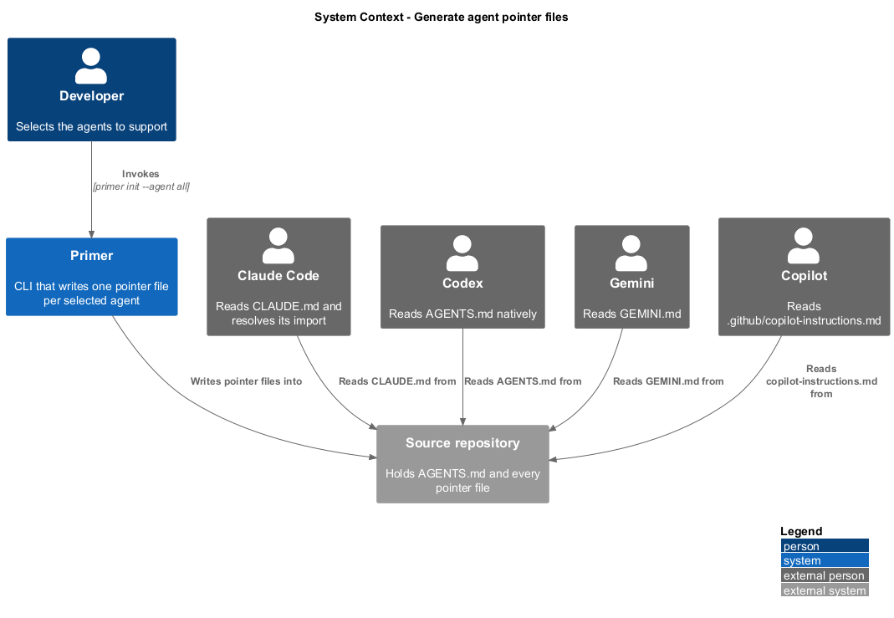
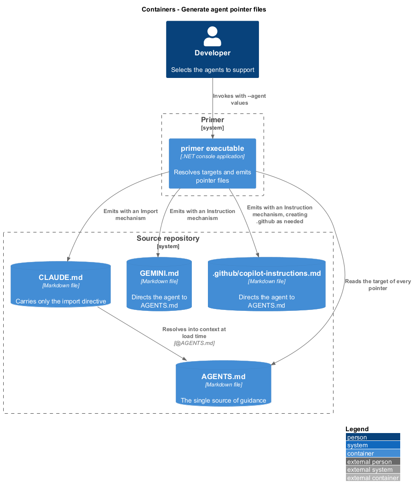
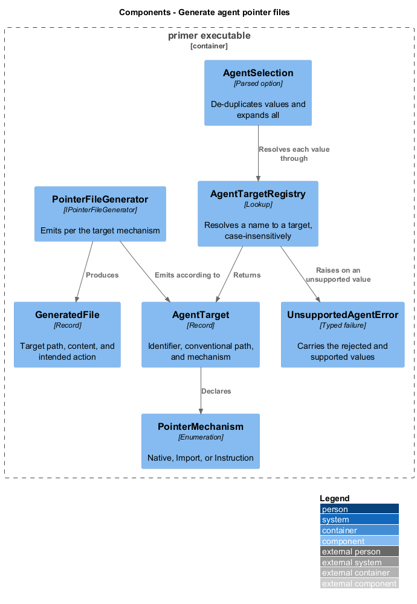
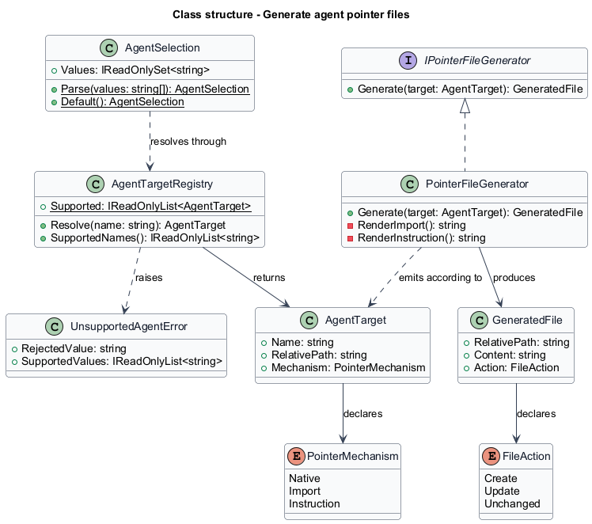
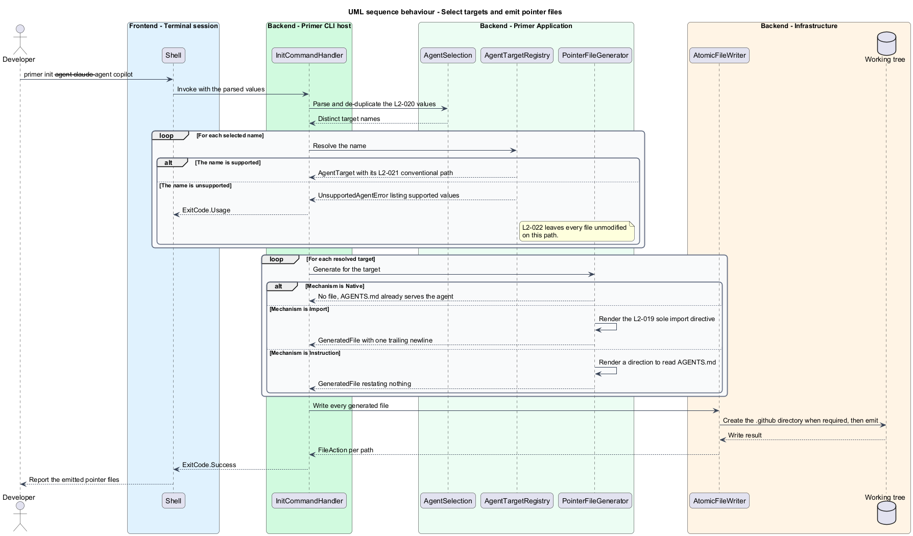

# Generate agent pointer files

## Overview

Coding agents do not agree on a filename. Codex reads `AGENTS.md`, Claude Code
reads `CLAUDE.md`, Gemini reads `GEMINI.md`, and Copilot reads
`.github/copilot-instructions.md`. Maintaining the same guidance in four files
guarantees that three of them go stale. This feature writes one instruction file
per selected agent, each of which points at `AGENTS.md` rather than restating it.

**pointer file** — tool-specific instruction file whose entire content directs the
reading agent to `AGENTS.md`

**import directive** — `@` reference that Claude Code resolves at load time,
placing the referenced file's content into context

**agent target** — supported tool, its conventional file path, and the mechanism
by which it reaches `AGENTS.md`

A link and an import are not equivalent, and the distinction decides the design.
A Markdown link names the guidance; an agent that follows no links receives
nothing. An import resolves, so an agent reading `CLAUDE.md` alone obtains the
complete guidance with nothing duplicated. Where a target supports an import
mechanism, the generated file uses it. Where a target supports none, the
generated file instructs the agent to read `AGENTS.md` before proceeding, and
still restates nothing.

`CLAUDE.md` is the strictest case: its only non-empty line is the import
directive. There is no heading, no prose, and no maintenance note, because every
line that is not the import is a line that can drift out of agreement with
`AGENTS.md`.

Codex requires no file of its own. It reads `AGENTS.md` natively, so selecting it
adds no output beyond the file that already exists.

## Description

- **`AgentTarget`** — record describing one supported tool: its identifier, the
  conventional relative path of its instruction file, and its
  `PointerMechanism`.
- **`PointerMechanism`** — enumeration of `Native`, `Import`, and `Instruction`.
  `Native` writes no file, `Import` emits an import directive, and `Instruction`
  emits a direction to read `AGENTS.md`.
- **`AgentTargetRegistry`** — the fixed set of supported targets, resolving a
  case-insensitive name to an `AgentTarget` and reporting the supported names for
  the rejection message.
- **`IPointerFileGenerator`** and **`PointerFileGenerator`** — produce a
  `GeneratedFile` for a target according to its mechanism.
- **`AgentSelection`** — the parsed `--agent` values, de-duplicated and expanded
  when `all` is supplied. An empty selection expands to every supported target, so
  `primer init` alone writes a file for each. `--agent` narrows that set rather
  than opting into it: an unwanted pointer costs one line, while a missing one
  costs that tool its guidance entirely.
- **`UnsupportedAgentError`** — typed failure carrying the rejected value and the
  supported names, mapped to `ExitCode.Usage`.

## Requirements

The feature realizes the following level-2 (L2) requirements. Each L2
requirement refines a level-1 (L1) requirement, cited by identifier.

| L2 ID | Refines (L1) | Requirement |
|-------|--------------|-------------|
| `L2-019` | `L1-005` | The only non-empty line of a generated `CLAUDE.md` shall be the import directive `@AGENTS.md`, the import shall deliver the guidance into context, and the file shall end with exactly one trailing newline. |
| `L2-020` | `L1-005` | The `--agent` option shall be repeatable, shall accept `all`, shall de-duplicate its values, and shall default to writing a file for every supported agent. |
| `L2-021` | `L1-005` | Each agent's file shall be written to that tool's conventional path, Codex shall require no additional file, and a target supporting an import mechanism shall use it. |
| `L2-022` | `L1-005` | An unsupported `--agent` value shall name the supported values, shall exit `2`, and shall leave every file unmodified. |

## Diagrams

### System context

Each supported agent reads its own file. Every one of those files resolves to the
same `AGENTS.md`.

### Containers

The pointer files are separate stores in the repository, distinguished by the
mechanism each reading agent supports.

### Components

The registry maps a selected name to a target, and the generator emits according
to that target's mechanism.

### Class structure

`PointerMechanism` carries the variation between targets, so adding an agent is a
registry entry rather than a new code path.

### Behaviour — select targets and emit pointer files

Selection resolves before emission, so an unsupported value fails without any
file being written.

