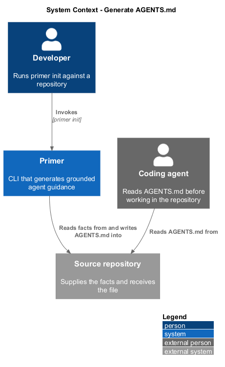
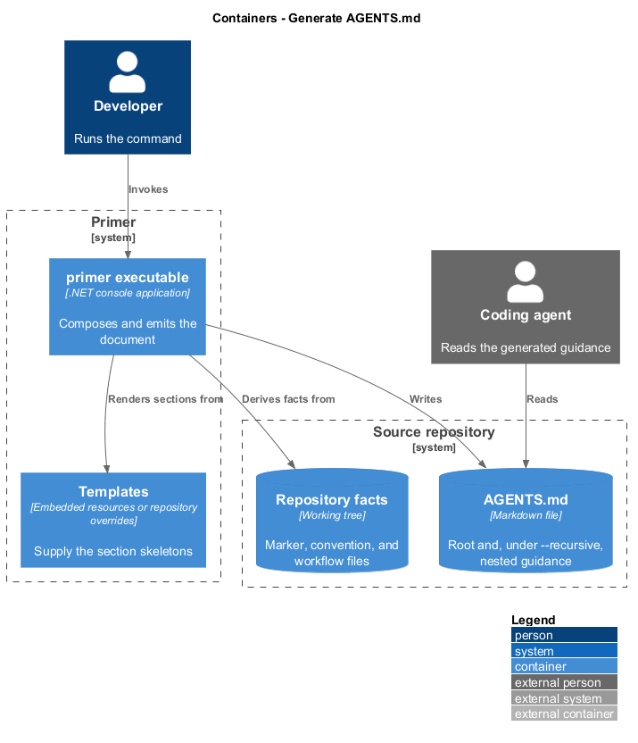
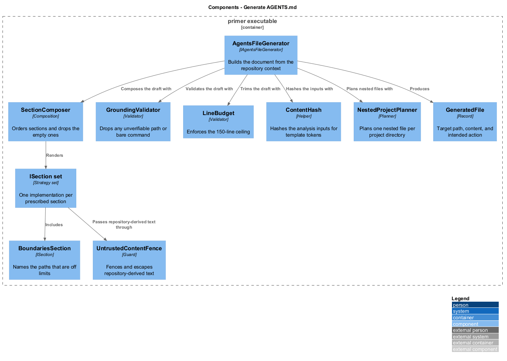
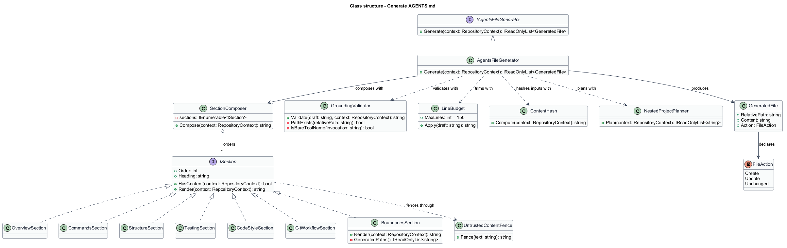
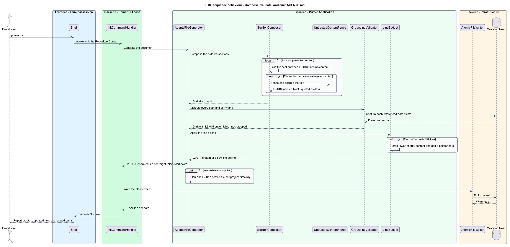

# Generate AGENTS.md

## Overview

`AGENTS.md` is the instruction file a coding agent reads to learn how a
repository is built, tested, and organised. This feature produces it from the
repository context, in a form short enough to be read in full and specific enough
to be acted on.

**AGENTS.md** — repository-root Markdown file carrying repository-specific
guidance for coding agents

**grounding** — property that every command and path emitted is verifiable
against the repository at generation time

Two constraints shape the output more than any other. The file stays at or below
150 lines, because guidance an agent truncates is guidance that does not apply.
And every fact in it is derived, never guessed: a section with no discovered
content is omitted rather than filled with a placeholder, and a command that
cannot be inferred is absent rather than approximated. A file containing
`<your test command>` is worse than a file with no testing section, because an
agent cannot tell the difference between a placeholder and an instruction.

Repository content is treated as untrusted input. A file in the repository may
contain text that reads as an instruction to an agent, and such text is not
copied into generated guidance as though the repository had authored a directive.
Where repository-derived text appears, it appears inside a fenced block labelled
as repository content, and text bound for a code span has its backticks replaced
so it cannot close the span and continue as prose the tool appears to have
written.

A repository holding more than one independent project may carry nested guidance. The
root file describes the repository, and a nested file describes only its own
directory, so neither repeats the other.

## Description

- **`IAgentsFileGenerator`** and **`AgentsFileGenerator`** — build the document
  from a `RepositoryContext` and return a `GeneratedFile`.
- **`SectionComposer`** — assembles the ordered sections `Project Overview`,
  `Commands`, `Project Structure`, `Testing`, `Code Style`, `Git Workflow`, and
  `Boundaries`. A section whose content is empty is dropped rather than emitted.
- **`ISection`** — abstraction one implementation per section, each reporting
  whether it has content and rendering itself. Adding a section does not modify
  the composer.
- **`BoundariesSection`** — names generated and vendored directories, states that
  a lock file changes only through its package manager, and names `AGENTS.md`
  itself as generated together with the command that regenerates it.
- **`LineBudget`** — enforces the 150-line ceiling by dropping lower-priority
  content and emitting a note pointing at the fuller source.
- **`GroundingValidator`** — verifies before emission that every referenced path
  exists and that no command is a bare tool name. A violation drops the offending
  line rather than emitting it.
- **`UntrustedContentFence`** — wraps repository-derived text in a labelled fenced
  block, and neutralises a backtick in text bound for a code span.
- **`ContentHash`** — stable hash over the analysis inputs. The generated document
  does not carry it; it is available to a repository template override through the
  `{{ContentHash}}` token, for a repository that wants to record it.
- **`NestedProjectPlanner`** — under `--recursive`, identifies independent project
  directories and plans one nested file per directory, each scoped to its own
  subtree.
- **`GeneratedFile`** — record of the target path, the rendered content, and the
  `FileAction` the writer shall take.

## Requirements

The feature realizes the following level-2 (L2) requirements. Each L2
requirement refines a level-1 (L1) requirement, cited by identifier.

| L2 ID | Refines (L1) | Requirement |
|-------|--------------|-------------|
| `L2-013` | `L1-004` | `primer init` shall write an `AGENTS.md` at the repository root containing the prescribed sections in order, and shall omit a section that has no discovered content. |
| `L2-014` | `L1-004` | Generated guidance shall be 150 lines or fewer, and content dropped to meet that ceiling shall be replaced by a note pointing at the fuller source. |
| `L2-015` | `L1-004` | Every command and path emitted shall be real, exact, and verifiable against the repository, and no speculative statement shall be emitted in place of an underivable fact. |
| `L2-016` | `L1-004` | Generated guidance shall state explicitly which paths are off limits, including generated directories, lock files, and `AGENTS.md` itself. |
| `L2-017` | `L1-004` | Under `--recursive`, the tool shall emit one nested `AGENTS.md` per detected project directory, each scoped to its own directory and not repeating the root file. |
| `L2-018` | `L1-004` | A generated `AGENTS.md` shall be plain Markdown, carrying no HTML comment, no delimiter, and no recorded tool version or content hash, and two runs over an unchanged repository shall produce byte-identical files. |
| `L2-048` | `L1-011` | Repository-derived text shall not be emitted as agent guidance, and shall appear only inside a labelled fenced block. |

## Diagrams

### System context

Generation reads the derived repository context and writes one file back into the
repository the agent later reads.

### Containers

The repository is both the source of the facts and the destination of the file.
The coding agent is a separate consumer of the result.

### Components

`AgentsFileGenerator` composes sections, then passes the draft through grounding
validation and the line budget before emission.

### Class structure

Sections sit behind one interface so the composer is closed to modification, and
the validators form a pipeline over the composed draft.

### Behaviour — compose, validate, and emit

Composition happens first, validation second, and emission last, so an ungrounded
line is dropped before the line budget is measured.

