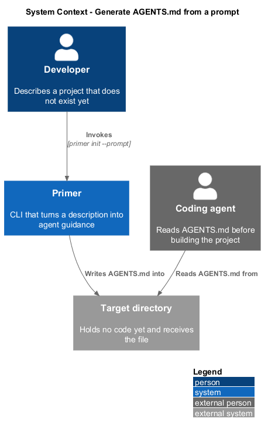
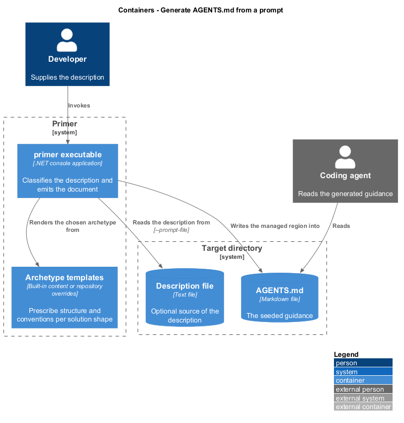
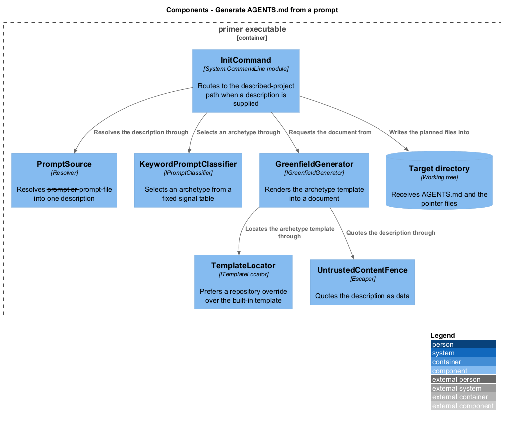
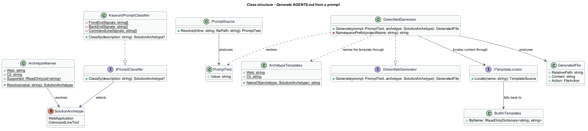
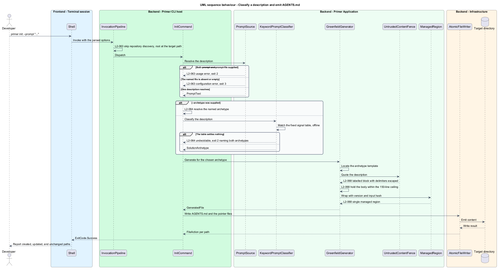

# Generate AGENTS.md from a prompt

## Overview

Analysis writes down what a repository already contains. At the moment a project
starts there is nothing to write down: no marker files, no build command, no
structure. The guidance is most valuable exactly where analysis has least to say.

This feature supplies the other direction. A description of a project that does
not exist yet is turned into the `AGENTS.md` that project shall be built under,
before any code is written.

**description** — prose the operator supplies, inline or in a file, stating what
the project is

**solution archetype** — the shape a project takes, deciding its folder outline
and the conventions its guidance prescribes

**signal phrase** — a word or phrase whose presence in a description indicates one
archetype

Two archetypes exist. A **web application** has a served back end and a browser
front end, and its guidance prescribes `backend/`, `frontend/`, `design-system/`,
and `e2e/`, Clean Architecture over MediatR, an Angular multi-project workspace
whose projects sit under `frontend/projects/`, services reached through an
interface and an injection token, and Playwright page objects. A **command-line tool** runs on a machine with no browser front end,
and its guidance prescribes `src/` and `tests/` at the root, `System.CommandLine`,
and packaging as a .NET tool. A command-line tool named inside a web application
is a project under `backend/src`, not a second archetype.

Selection is a fixed table of signal phrases, consulted offline. The same
description always selects the same archetype, and no service is consulted. A
description the table cannot settle is refused rather than guessed at: the wrong
folder outline is not a defect the reader can detect by reading, so an archetype
that cannot be derived shall be asked for instead of invented.

The mode requires no repository. Describing a project usually precedes `git init`,
so discovery of a repository root is skipped and the target directory becomes the
root. Writes remain confined to that directory by the same resolver that confines
analysis.

Greenfield output is a seed. Once code exists, an analysis run supersedes it, and
`primer check` continues to verify only what analysis produces.

## Description

- **`SolutionArchetype`** — enumeration of `WebApplication` and `CommandLineTool`.
- **`ArchetypeNames`** — the command-line spellings `web` and `cli`, resolving a
  value to a `SolutionArchetype` and reporting the supported names for a rejection.
- **`PromptText`** — the single description one run was given.
- **`PromptSource`** — resolves `--prompt` or `--prompt-file` into a `PromptText`.
  It rejects the two options together, a file that is absent or unreadable, a
  description that is empty, and a file larger than the configured read cap.
  Reading lives here rather than in the command, so no feature folder reaches the
  file system directly.
- **`IPromptClassifier`** and **`KeywordPromptClassifier`** — select an archetype
  from the description. A null result is a real answer: the description settles
  nothing. The classifier normalises the description to space-separated lowercase
  words and matches padded phrases, so `api` does not match inside `rapid`.
- **`ArchetypeTemplates`** — the guidance each archetype prescribes, held as
  template content and resolved by the name `agents.web.md` or `agents.cli.md`.
- **`IGreenfieldGenerator`** and **`GreenfieldGenerator`** — render the archetype's
  template, quote the description, and hold the result within the line ceiling.
  The generator does not ground the result against the
  working tree: the folder outline names directories the project is about to
  create, and confirming their absence would delete the outline.
- **`BuiltInTemplates`** — the built-in content for each template name, supplied by
  composition. A template is content a generator owns; the locator's part is only
  to prefer a repository override, so an override at the configured template path
  applies to an archetype exactly as it applies to the analysis template.
- **`InitCommand`** — routes to this path when a description is supplied, and to
  analysis otherwise. Both paths converge on the same overwrite policy, dry-run
  reporter, and writer, so previewing and pointer-file generation behave identically
  in either mode.

`GreenfieldGenerator` derives two values from the target directory. The directory
name is the project name. A namespace-safe form of that name supplies the
namespace example, because a directory may be called `my-app` and a namespace may
not; an example that does not compile is worse than no example, since the agent
following it cannot tell.

The interface `IPromptClassifier` is the seam a model-backed implementation
occupies later. Nothing behind that seam is stubbed, and no configuration
describes a mode that does not exist.

## Requirements

The feature realizes the following level-2 (L2) requirements. Each L2
requirement refines a level-1 (L1) requirement, cited by identifier.

| L2 ID | Refines (L1) | Requirement |
|-------|--------------|-------------|
| `L2-063` | `L1-015` | `primer init` shall accept a description through `--prompt` or `--prompt-file`, shall reject the two together, shall reject an absent or empty description, and shall require no git repository. |
| `L2-064` | `L1-015` | The archetype shall be selected deterministically and offline, shall be overridable by `--archetype`, and a description determining no archetype shall be refused with exit `2` naming both archetypes. |
| `L2-065` | `L1-015` | The web application archetype shall emit the `backend`, `frontend`, `design-system`, and `e2e` outline with every Angular project under `frontend/projects/`, Clean Architecture with thin controllers over a pinned MediatR, agreeing folders and namespaces, the library workspace, interface-and-token service consumption, and the design system as a standalone deliverable. |
| `L2-066` | `L1-015` | The CLI archetype shall emit `src` and `tests` at the root, and shall state .NET with `System.CommandLine`, packaging as an installable .NET tool, the Microsoft.Extensions patterns, and SOLID. |
| `L2-067` | `L1-015` | Every archetype shall state that speed is not the goal, that implementation is radically simple, that development is acceptance-test-driven, and that architecture tests shall never be written. |
| `L2-068` | `L1-015` | The description shall appear quoted as data, no Domain Language section shall be emitted, the same description shall regenerate byte-identically, the file shall stay within 150 lines untruncated, and the pointer files shall be written alongside. |

## Diagrams

### System context

The description replaces the repository as the source of fact. The target
directory receives the file and holds nothing the tool reads.

### Containers

The archetype templates are a separate store from the target directory, so a
repository may override one without the tool being rebuilt.

### Components

Resolution, classification, and rendering are separate components. Classification
is the only one a later model-backed implementation replaces.

### Class structure

`IPromptClassifier` returns a nullable archetype, which is what carries "the
description settles nothing" as a value rather than as an exception or a default.

### Behaviour — classify a description and emit the document

Resolution and classification both complete before anything is written, so a
rejected description leaves the target directory untouched.

