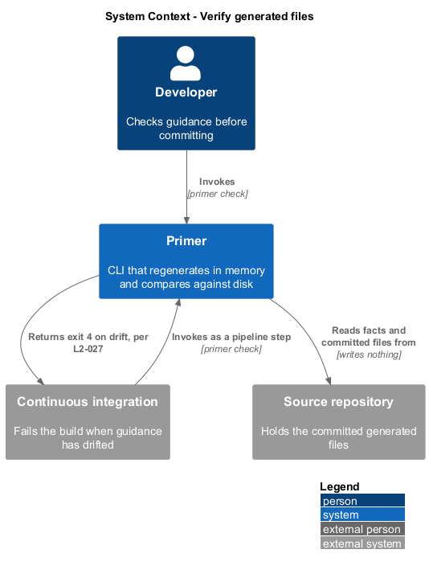
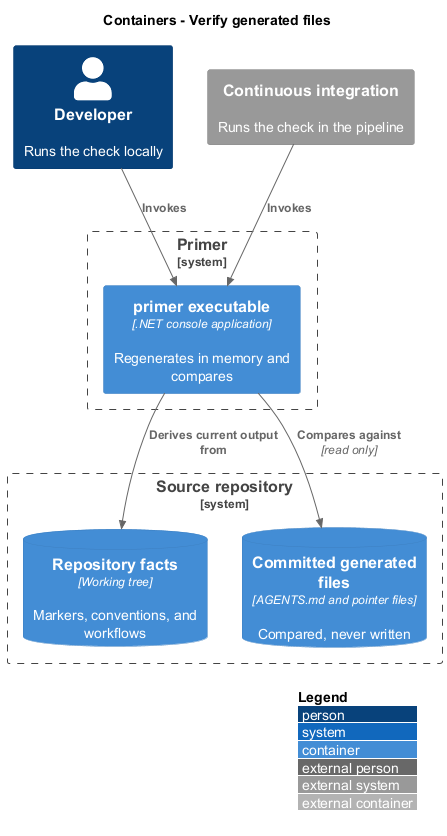
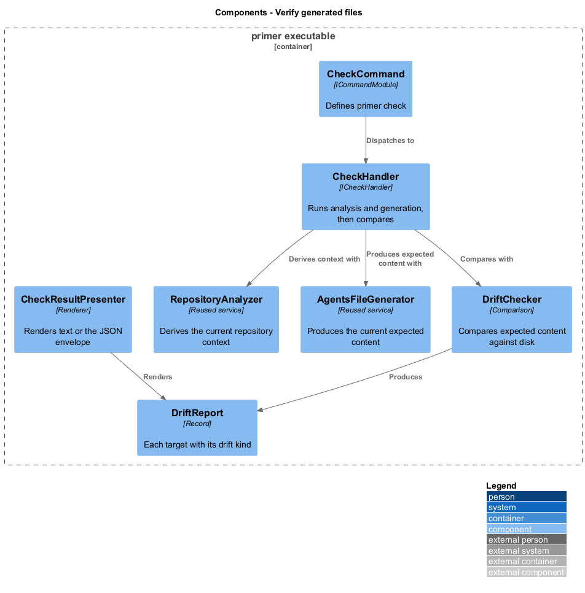
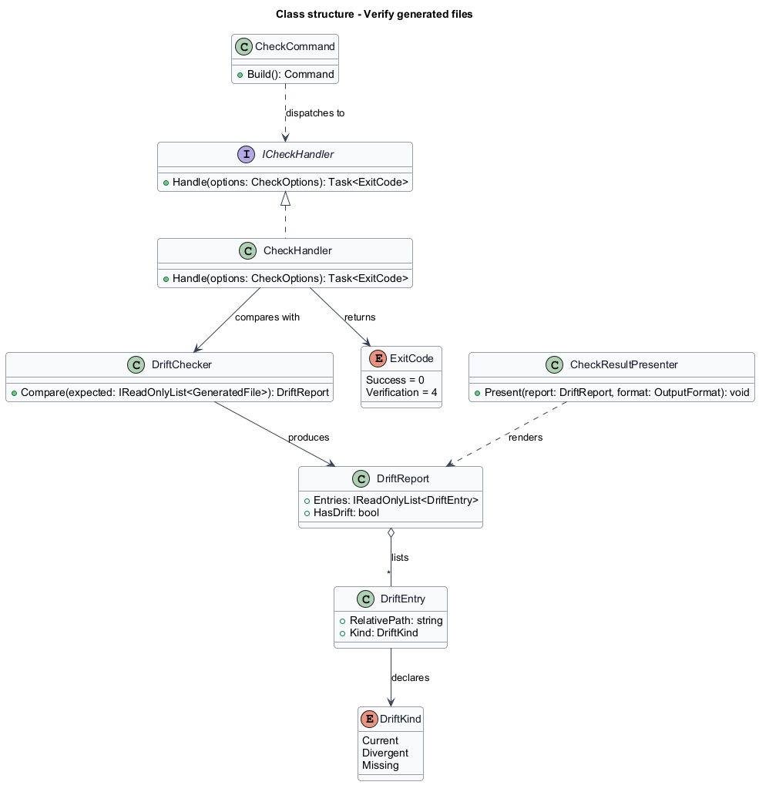
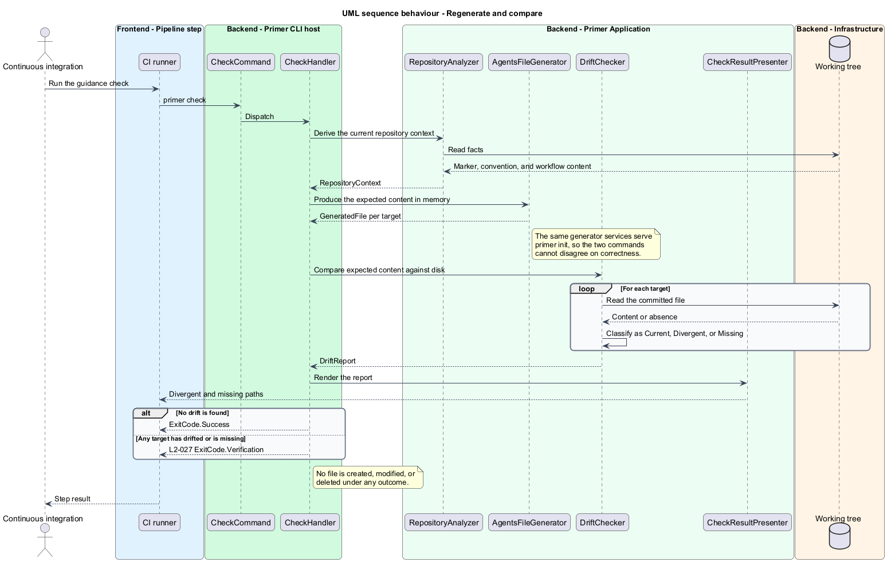

# Verify generated files

## Overview

Generated guidance decays. A repository adds a test project, changes its build
command, or renames a directory, and the `AGENTS.md` committed alongside it
quietly stops describing the repository. This feature detects that divergence.

**drift** — state in which a committed generated file differs from what
generation would currently produce

**verification run** — invocation of `primer check`, which reports drift and
changes nothing

`primer check` performs the same analysis and generation as `primer init` and
then compares rather than writes. The comparison is what makes the check
trustworthy: it does not consult a recorded timestamp or a stored marker that
could itself be stale, it regenerates and diffs.

The command is built for continuous integration. It exits `4` when any file is
missing or divergent, so a pipeline step fails when a contributor changes the
build without regenerating the guidance. It writes nothing under any outcome,
which means it is safe to run against a checkout that shall remain pristine.

## Description

- **`CheckCommand`** — the command module defining `primer check`.
- **`ICheckHandler`** and **`CheckHandler`** — run analysis and generation, then
  delegate comparison. The handler resolves the same generator services as
  `primer init`, so the two commands cannot diverge in what they consider
  correct.
- **`DriftChecker`** — compares each `GeneratedFile` against the file on disk and
  produces a `DriftReport`.
- **`DriftReport`** — record listing each target with a `DriftKind`, and exposing
  whether any divergence was found.
- **`DriftKind`** — enumeration of `Current`, `Divergent`, and `Missing`.
- **`CheckResultPresenter`** — renders the report as text or as the JSON envelope,
  naming each divergent path.

## Requirements

The feature realizes the following level-2 (L2) requirements. Each L2
requirement refines a level-1 (L1) requirement, cited by identifier.

| L2 ID | Refines (L1) | Requirement |
|-------|--------------|-------------|
| `L2-027` | `L1-006` | `primer check` shall exit `0` when every generated file matches current output, shall report the differing or missing paths and exit `4` otherwise, and shall create, modify, or delete no file under any outcome. |

## Diagrams

### System context

Verification serves a developer before a commit and a continuous-integration job
after one. Neither invocation changes the repository.

### Containers

The command reads the same repository facts as generation and compares against
the committed files rather than writing to them.

### Components

`CheckHandler` reuses the generator services, so the definition of a correct file
lives in one place.

### Class structure

`DriftChecker` depends on the generator output rather than on stored state, so a
stale marker cannot produce a false pass.

### Behaviour — regenerate and compare

Generation runs in memory and the result is compared against disk. No writer
participates in this path at all.

