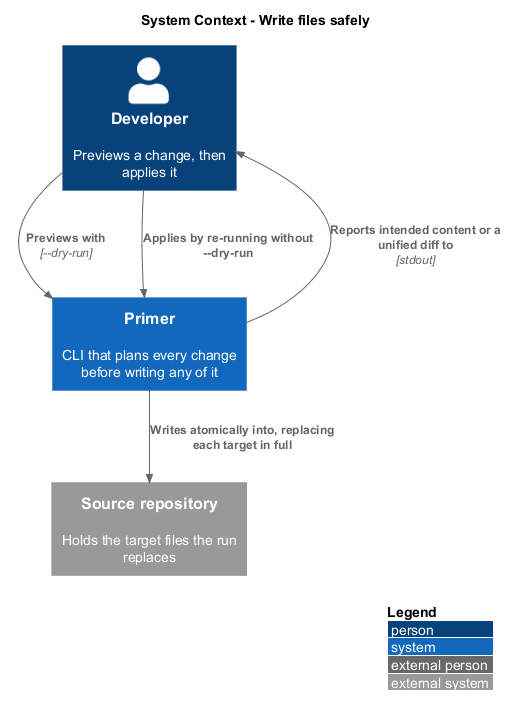
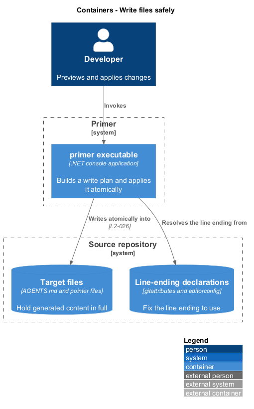
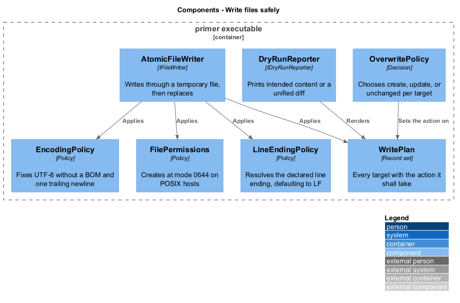
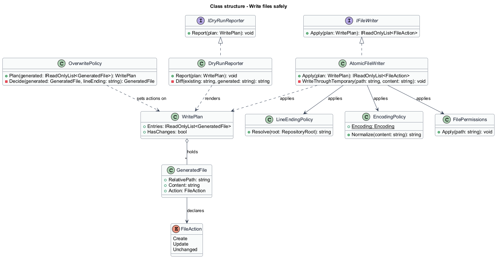
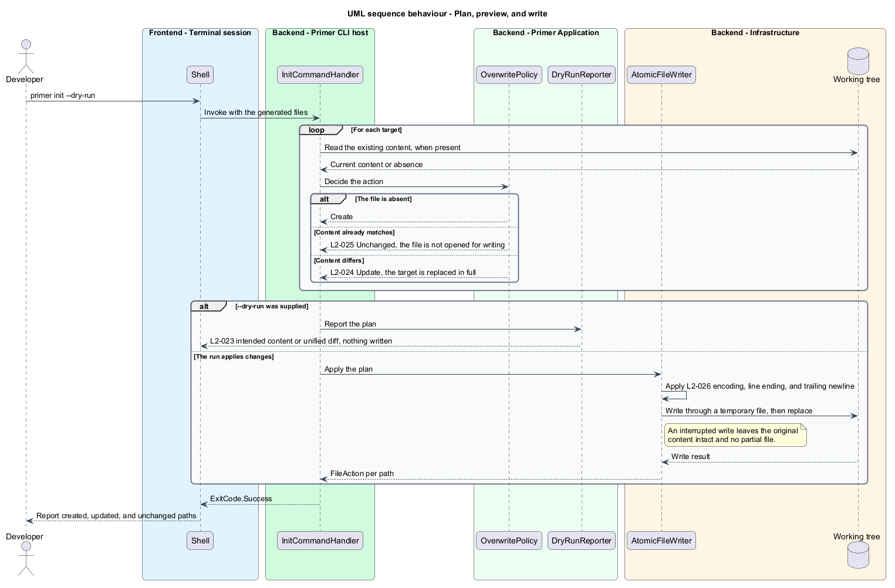

# Write files safely

## Overview

Primer writes into repositories that already contain work. This feature covers
the guarantees that make that acceptable: a run can be previewed before it
happens, a repeated run changes nothing, and a failure part-way through leaves no
damaged file behind.

**dry run** — mode in which every intended change is reported and no file is
written

**idempotence** — property that repeating a run against an unchanged repository
produces byte-identical results and reports no change

**atomic write** — write that either completes fully or leaves the previous
content intact, with no partial or zero-length file at the target path

Every target is generated in full, so writing is a replacement rather than a
merge. The tool holds no opinion about how an existing file came to be there: it
renders what the repository currently implies and writes that. The file is the
tool's output, not a shared document, and guidance a team authors belongs in a
file the tool does not write.

What that costs is edit preservation, and the compensation is that the outcome is
predictable from the repository alone. What it does not cost is idempotence: a
target whose bytes already match is reported `unchanged` and never opened, so its
timestamp does not move and a repeated run remains a no-op.

Encoding is fixed rather than inherited from the ambient environment. Generated
files are UTF-8 without a byte-order mark and end with exactly one trailing
newline, and line endings follow what the repository declares rather than what
the host platform prefers.

## Description

- **`IFileWriter`** and **`AtomicFileWriter`** — write through a temporary file in
  the destination directory, then replace the target, so an interrupted write
  cannot leave a partial file.
- **`WritePlan`** — the ordered set of `GeneratedFile` records with the
  `FileAction` each shall take. Every command produces a plan before writing.
- **`FileAction`** — enumeration of `Create`, `Update`, and `Unchanged`. A file
  reported `Unchanged` is not opened for writing, so its timestamp is preserved.
- **`IDryRunReporter`** and **`DryRunReporter`** — render the plan. For a new file
  it prints the intended content; for an existing one it prints a unified diff.
- **`OverwritePolicy`** — compares the rendered content against what is on disk and
  sets `Create`, `Update`, or `Unchanged` accordingly. It reads the target; it
  never merges with it.
- **`LineEndingPolicy`** — resolves the line ending from `.gitattributes`, then
  `.editorconfig`, defaulting to `LF`.
- **`EncodingPolicy`** — fixes UTF-8 without a byte-order mark and one trailing
  newline.
- **`FilePermissions`** — creates files at mode `0644` on POSIX hosts.

## Requirements

The feature realizes the following level-2 (L2) requirements. Each L2
requirement refines a level-1 (L1) requirement, cited by identifier.

| L2 ID | Refines (L1) | Requirement |
|-------|--------------|-------------|
| `L2-023` | `L1-006` | `--dry-run` shall report the intended content or a unified diff for every target, shall write no file, and shall report each path as `create`, `update`, or `unchanged`. |
| `L2-024` | `L1-006` | An existing target shall be reported `update` and replaced in full by generated content, whatever its prior content, and one that already matches shall be reported `unchanged` without its timestamp moving. |
| `L2-025` | `L1-006` | Repeating a run against an unchanged repository shall produce byte-identical files, shall report every path as `unchanged`, and shall not update timestamps. |
| `L2-026` | `L1-006` | Generated files shall be UTF-8 without a byte-order mark, shall end with exactly one trailing newline, shall follow the line ending the repository declares and `LF` otherwise, and a failed write shall leave the original content intact. |
| `L2-051` | `L1-011` | Files shall be created at mode `0644` or narrower on POSIX hosts, no analytics request shall be made absent telemetry configuration, and an unwritable target shall exit `3` rather than escalating privileges. |

## Diagrams

### System context

Writing is the only point at which Primer changes the repository, and the
developer can interpose a preview before it happens.

### Containers

The working tree holds two relevant stores: the target files, and the declarations
that fix line endings.

### Components

The overwrite policy decides the action for each target, and the atomic writer is
the single component that touches the file system.

### Class structure

The policies are separate types so that encoding, line endings, and overwrite
rules are each testable without a file system.

### Behaviour — plan, preview, and write

The plan is complete before the first byte is written, so a dry run and a real
run differ only in whether the writer is invoked.

