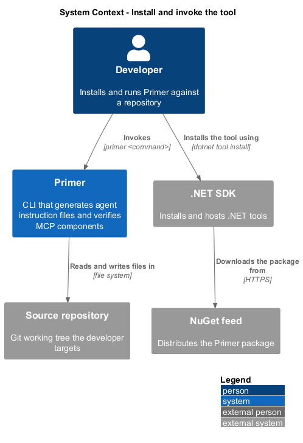
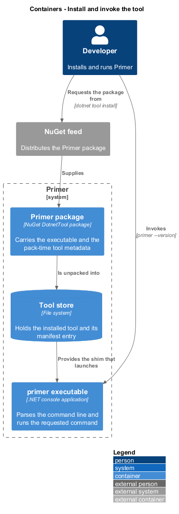
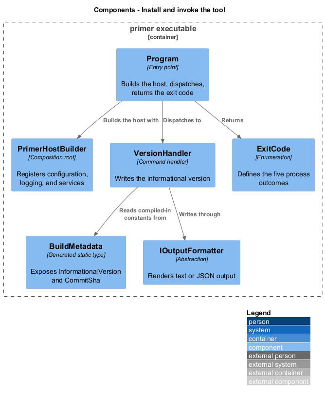
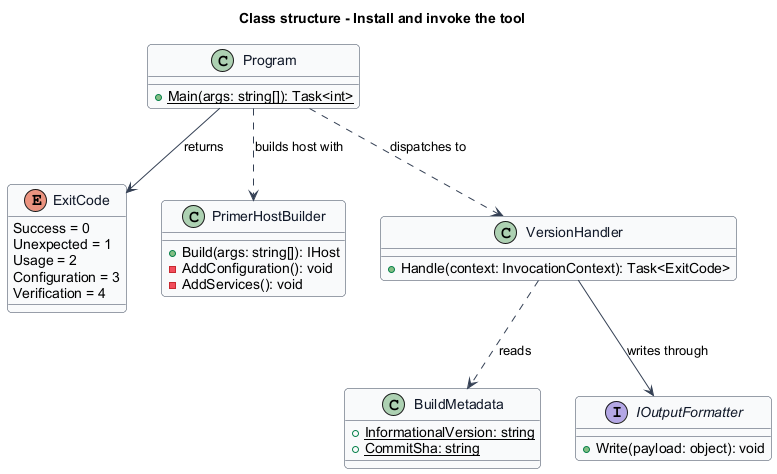
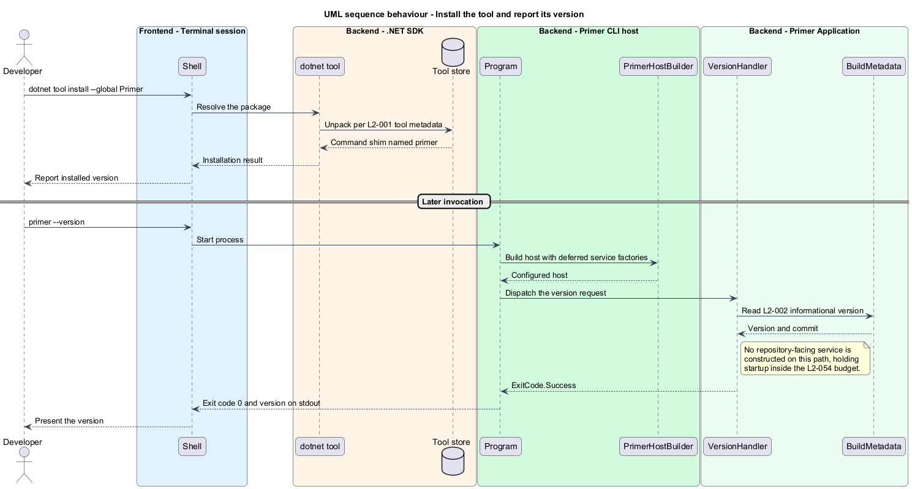

# Install and invoke the tool

## Overview

Primer is a command-line application that writes coding-agent instruction files
into a source repository and verifies that the Model Context Protocol (MCP)
components a repository depends on are present. Before any of that work can
happen, the application shall be obtainable, installable, and runnable from an
arbitrary working directory. This feature covers that path: packaging the
application, installing it, and invoking it.

**.NET tool** — NuGet package that carries an executable entry point and is
installed by the .NET SDK rather than referenced by a project

**tool manifest** — `dotnet-tools.json` file that pins tool versions for a single
repository, enabling local rather than machine-wide installation

**informational version** — Semantic Versioning 2.0.0 string that identifies an
exact build, including any prerelease and build-metadata segments

A developer installs Primer once, globally or against a repository's tool
manifest, and thereafter invokes `primer` as an ordinary command. The command
name is fixed at pack time and does not vary by installation mode. Version
reporting exists so that a developer, a support channel, or a CI log can
establish exactly which build produced a given result.

Invocation cost matters at this boundary. `primer --version` and `primer --help`
are the two commands a developer runs most often and the two that carry the least
work, so both complete without touching the repository at all.

## Description

The feature is a vertical slice from the packaging metadata through process
startup to the first line of output.

- **`Primer.csproj`** — project file carrying the pack-time metadata:
  `PackAsTool`, `ToolCommandName` of `primer`, package identity, licence
  expression, and repository URL.
- **`Program`** — process entry point. It builds the host, dispatches the parsed
  command line, and returns the resulting exit code to the operating system.
- **`PrimerHostBuilder`** — composes the generic host: configuration sources,
  logging, options binding, and the service container described in
  `resolve-configuration`.
- **`BuildMetadata`** — static type generated at build time. It exposes
  `InformationalVersion` and `CommitSha`, sourced from assembly attributes, so
  version reporting reads compiled-in constants rather than computing anything.
- **`VersionHandler`** — handler bound to the `--version` option. It writes the
  version through the active output formatter and returns without constructing
  any repository-facing service.
- **`ExitCode`** — enumeration of the five outcomes the process may return:
  `Success`, `Unexpected`, `Usage`, `Configuration`, and `Verification`.

Startup cost is held down by deferring construction. `PrimerHostBuilder`
registers repository-facing services as factory registrations, so a run that
terminates in `VersionHandler` never instantiates the analysis or generation
graph.

## Requirements

The feature realizes the following level-2 (L2) requirements. Each L2
requirement refines a level-1 (L1) requirement, cited by identifier.

| L2 ID | Refines (L1) | Requirement |
|-------|--------------|-------------|
| `L2-001` | `L1-001` | The `Primer` project shall produce a NuGet package flagged as a .NET tool with the command name `primer`, installable globally or as a local tool manifest entry. |
| `L2-002` | `L1-001` | The tool shall report a Semantic Versioning 2.0.0 informational version that identifies the exact build. |
| `L2-054` | `L1-012` | `primer --version` shall complete in under 200 ms and `primer --help` in under 300 ms at the 95th percentile, and neither shall perform repository analysis. |

## Diagrams

### System context

A developer obtains Primer from a NuGet feed through the .NET SDK, then invokes
it against a local source repository.

### Containers

The published package and the installed executable are distinct containers: the
SDK moves the first into the tool store, and the developer runs the second.

### Components

Inside the installed executable, `Program` builds the host and dispatches to a
handler. `VersionHandler` reads compiled-in constants from `BuildMetadata`.

### Class structure

`Program` returns an `ExitCode`. `VersionHandler` depends on `BuildMetadata` and
on the output formatter, and on nothing that reads the repository.

### Behaviour — install the tool and report its version

Installation runs once through the .NET SDK. Each later invocation starts the
process, builds the host, and dispatches; the `--version` path returns before any
repository-facing service is constructed.

