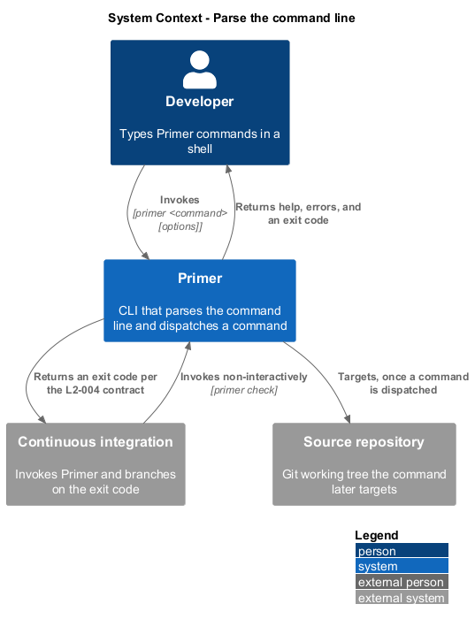
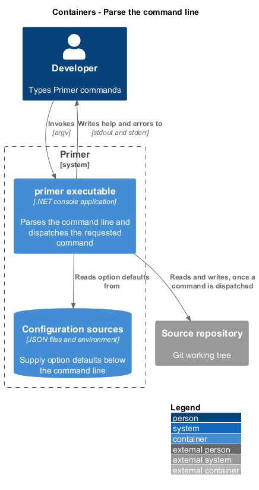
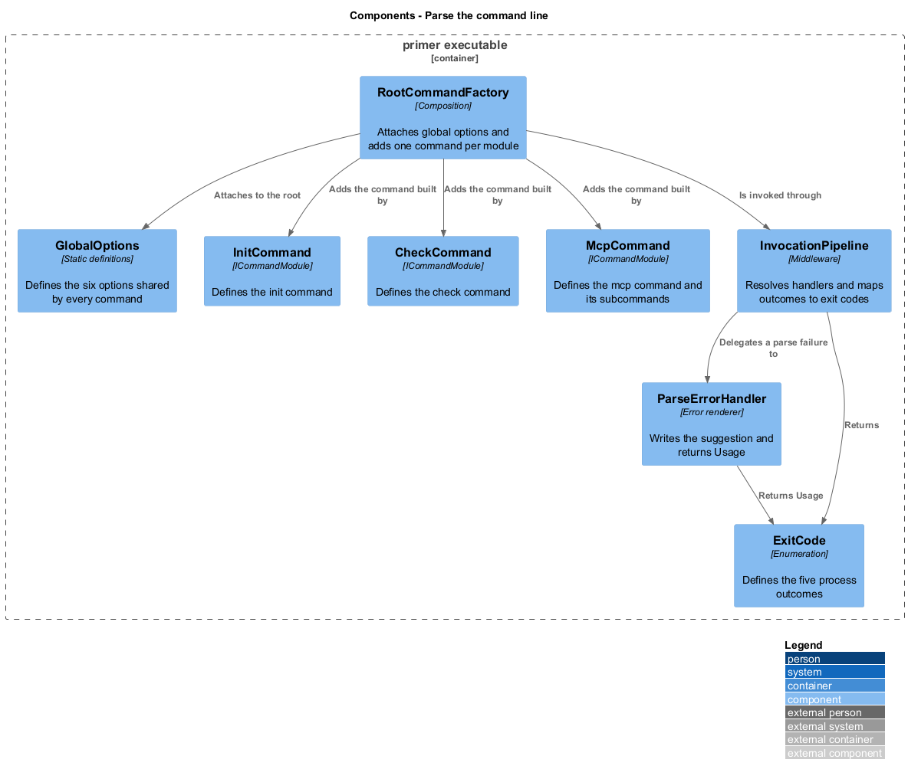
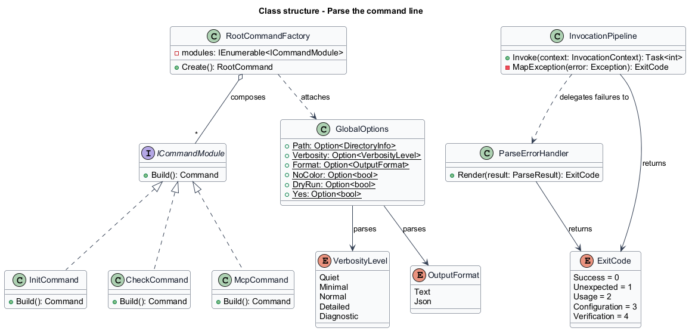
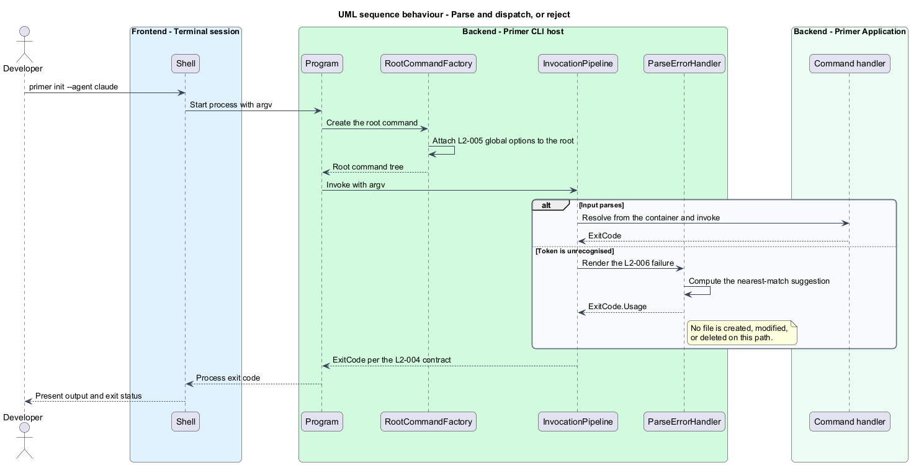

# Parse the command line

## Overview

Every Primer run begins by turning an argument vector into a command, a set of
option values, and a decision about whether the input is valid at all. This
feature covers that translation and the contract the process reports back to its
caller.

**root command** — top-level command that owns the global options and the
subcommand tree

**global option** — option accepted by every command in the tree with identical
meaning

**exit-code contract** — fixed mapping from outcome to process exit code, on
which scripts and continuous integration depend

The command surface is built on `System.CommandLine`, which supplies parsing,
help generation, and token suggestion. The design constrains that library in two
ways. Every command is defined in its own file, so a reader locates a command by
name without searching a registration table. Every global option is defined once
and attached to the root, so no command can drift into accepting a different
spelling or meaning.

Rejection is part of the surface. A mistyped command produces a suggestion and a
usage exit code, and it changes nothing on disk. That guarantee is what makes the
tool safe to invoke from a script that may pass an unexpected argument.

## Description

- **`RootCommandFactory`** — assembles the root command. It attaches the global
  options, then adds one `Command` per registered `ICommandModule`.
- **`ICommandModule`** — abstraction implemented once per command file. It
  exposes `Build()`, returning the configured `Command` including that command's
  own options and handler binding.
- **`GlobalOptions`** — static definitions of `--path`, `--verbosity`,
  `--format`, `--no-color`, `--dry-run`, and `--yes`, each with its description
  and parse behaviour.
- **`InitCommand`, `CheckCommand`, `McpCommand`** — one file per command, each an
  `ICommandModule`. `McpCommand` owns the `list`, `check`, and `install`
  subcommands.
- **`ExitCode`** — enumeration mapping outcome to process code.
- **`ParseErrorHandler`** — renders a parse failure to stderr, including the
  nearest-match suggestion supplied by `System.CommandLine`, and returns
  `ExitCode.Usage`.
- **`InvocationPipeline`** — middleware chain that resolves the handler from the
  service container, applies the verbosity and format selections, and maps a
  thrown exception onto the exit-code contract.

## Requirements

The feature realizes the following level-2 (L2) requirements. Each L2
requirement refines a level-1 (L1) requirement, cited by identifier.

| L2 ID | Refines (L1) | Requirement |
|-------|--------------|-------------|
| `L2-003` | `L1-002` | Invoking the tool without arguments, or with `--help` at any level, shall render help that lists every available command and option. |
| `L2-004` | `L1-002` | The tool shall return exit codes according to a fixed contract so that scripts and CI can branch on the outcome. |
| `L2-005` | `L1-002` | Every global option shall be accepted by every command with identical semantics. |
| `L2-006` | `L1-002` | Mistyped input shall fail fast with a suggestion rather than silently doing nothing. |

## Diagrams

### System context

Parsing sits between the developer's shell and the rest of Primer. The exit code
it returns is consumed by scripts and continuous integration as well as by the
developer.

### Containers

The parse stage runs inside the single `primer` executable; no other container
participates. The diagram shows the stores the resulting command later reaches.

### Components

`RootCommandFactory` composes the tree from the registered command modules, and
the invocation pipeline maps every outcome onto `ExitCode`.

### Class structure

Each command file implements `ICommandModule`. The global options are defined
once and attached to the root command rather than duplicated per command.

### Behaviour — parse and dispatch, or reject

The happy path resolves a handler and returns its exit code. A parse failure
returns `ExitCode.Usage` and leaves the repository untouched.

