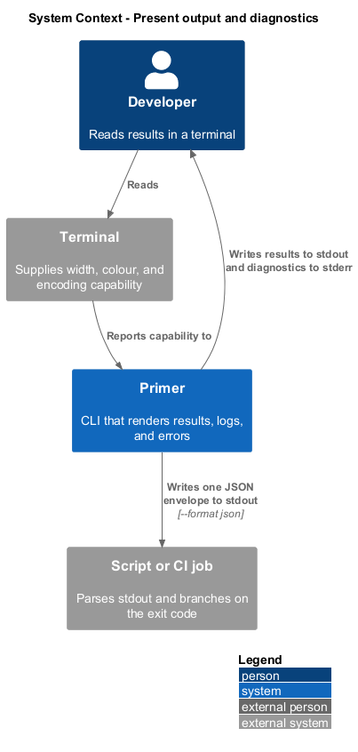
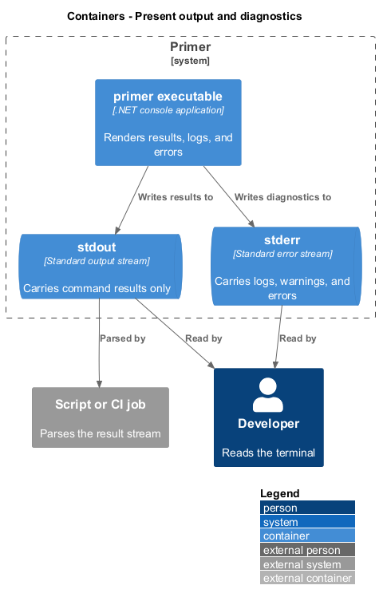
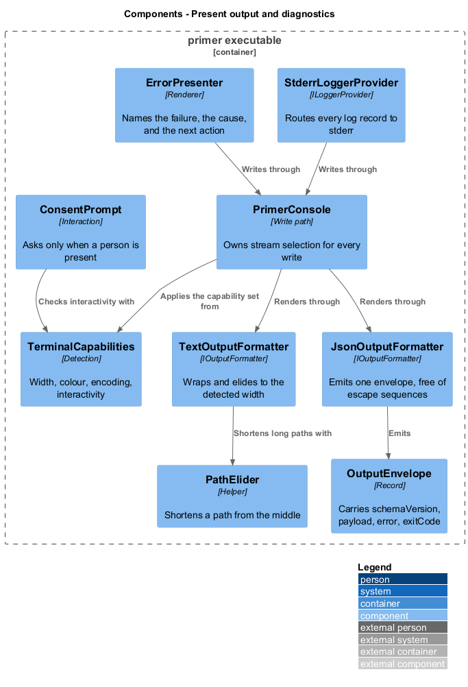
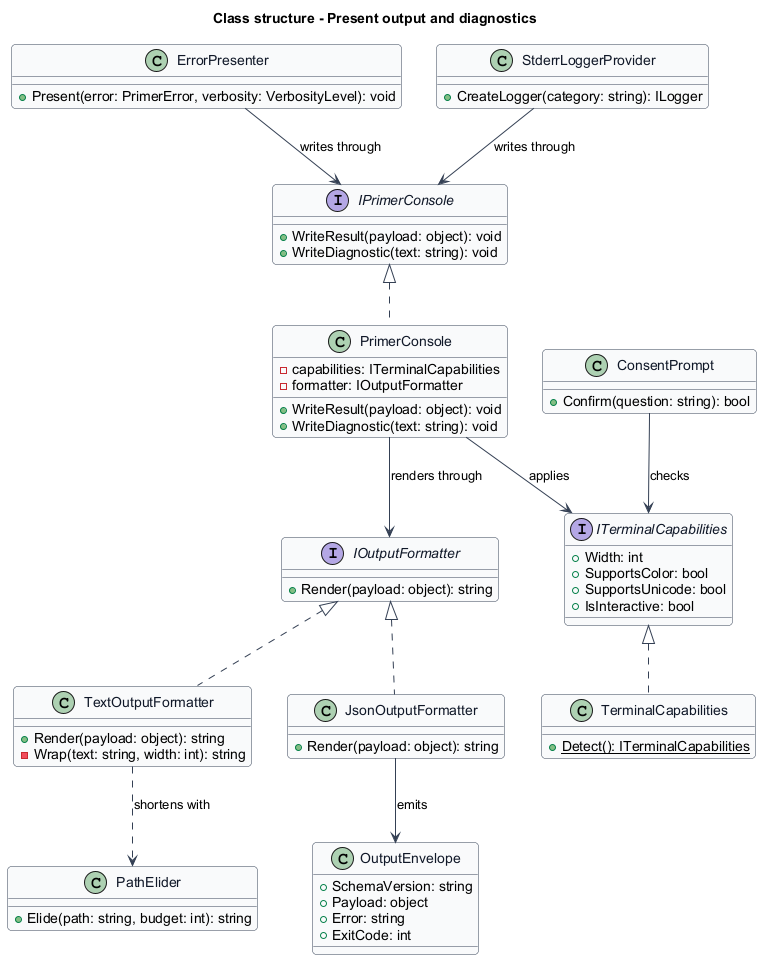
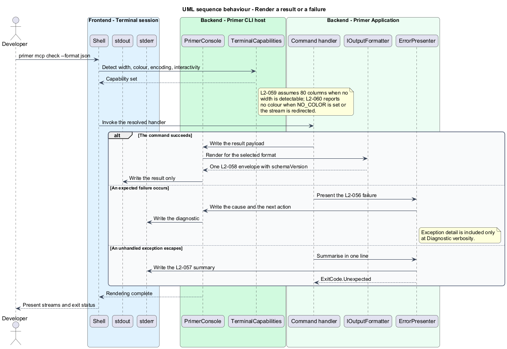

# Present output and diagnostics

## Overview

Primer writes to two audiences at once: a developer reading a terminal and a
script parsing a stream. This feature covers how the two are kept apart, how
output adapts to the terminal it lands in, and how a failure is reported.

**stream discipline** — rule that command results go to stdout and everything
else goes to stderr

**terminal capability** — property of the attached terminal that shapes
rendering: width, colour support, encoding, and whether a person is present

**envelope** — outer JSON object carrying a schema version alongside the payload
or the error

The separation of streams is what allows `primer mcp check --format json` to be
piped into a parser while diagnostics remain visible to the developer. Nothing
that is not a command result reaches stdout, and a JSON run emits exactly one
document there.

Adaptation is not decoration. A 40-column terminal shall still show every
essential value, so a long repository path elides in the middle rather than being
cut off at the right margin. Colour is an enhancement layered on top of a text
marker that already carries the same meaning, so a redirected or colour-blind
reading loses no information.

Non-interactive contexts are treated as a first-class case. A run under
continuous integration shall never wait for input and shall never emit a spinner
or a cursor-repositioning sequence into a log file.

## Description

- **`ITerminalCapabilities`** and **`TerminalCapabilities`** — detect and expose
  `Width`, `SupportsColor`, `SupportsUnicode`, and `IsInteractive`. Detection
  consults the attached terminal, the `NO_COLOR` variable, and the `CI` variable.
- **`IPrimerConsole`** and **`PrimerConsole`** — the only abstraction through
  which a handler writes. It owns stream selection and applies the capability
  set to every write.
- **`IOutputFormatter`**, **`TextOutputFormatter`**, **`JsonOutputFormatter`** —
  render a payload. The text formatter wraps and elides to the detected width;
  the JSON formatter emits one `OutputEnvelope` and never emits an escape
  sequence.
- **`OutputEnvelope`** — record carrying `SchemaVersion`, the payload, and, on
  failure, `Error` and `ExitCode`.
- **`PathElider`** — shortens a path to a budget by removing interior segments
  while retaining the leading and trailing ones.
- **`StderrLoggerProvider`** — `ILoggerProvider` writing every log record to
  stderr with timestamp, level, and category, gated by the resolved verbosity.
- **`ErrorPresenter`** — renders an expected failure as a message naming what
  failed, the path or value responsible, and the next action. It includes the
  exception detail only at `Diagnostic` verbosity.
- **`ConsentPrompt`** — asks a yes-or-no question when a person is present, and
  fails with `ExitCode.Configuration` when one is not and `--yes` was not passed.

## Requirements

The feature realizes the following level-2 (L2) requirements. Each L2
requirement refines a level-1 (L1) requirement, cited by identifier.

| L2 ID | Refines (L1) | Requirement |
|-------|--------------|-------------|
| `L2-055` | `L1-013` | Diagnostic and warning output shall be written to stderr, and only command results shall be written to stdout. |
| `L2-056` | `L1-013` | An expected failure shall name what failed, the responsible path or value, and the next action, and a stack trace shall appear only at `Diagnostic` verbosity. |
| `L2-057` | `L1-013` | An unhandled exception shall exit `1` with a single-line summary, and shall leave no partially written file. |
| `L2-058` | `L1-013` | Machine-readable output shall be a single JSON object carrying `schemaVersion`, shall carry `error` and `exitCode` on failure, and shall contain no ANSI escape sequence. |
| `L2-059` | `L1-014` | Output shall adapt to the terminal width, shall assume 80 columns when no width is detectable, and shall elide a long path in the middle rather than truncating it. |
| `L2-060` | `L1-014` | Colour shall be emitted only to an interactive colour-capable terminal, and a failure distinguished by colour shall also carry a text marker of the same meaning. |
| `L2-061` | `L1-014` | A non-interactive session shall never block for input and shall emit no spinner, progress bar, or cursor-repositioning sequence. |
| `L2-062` | `L1-014` | Output shall fall back to ASCII substitutes when the console encoding cannot represent a character, and shall preserve non-ASCII repository paths exactly. |

## Diagrams

### System context

Output reaches a developer at a terminal and a script or continuous-integration
job reading the streams. Both consume the same run.

### Containers

The executable writes to two streams. The diagram distinguishes them because the
stream a byte lands on is the contract, not an implementation detail.

### Components

`PrimerConsole` is the single write path. Capability detection feeds the
formatters, and logging is routed to stderr by its own provider.

### Class structure

Formatters share one interface, so a handler writes a payload without knowing
which representation is active.

### Behaviour — render a result or a failure

Capabilities are detected once per run. The selected formatter renders to stdout
while logs and errors travel to stderr.

