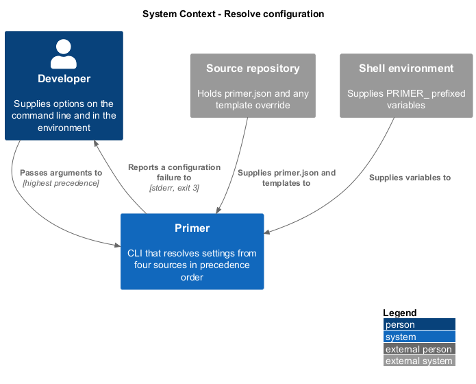
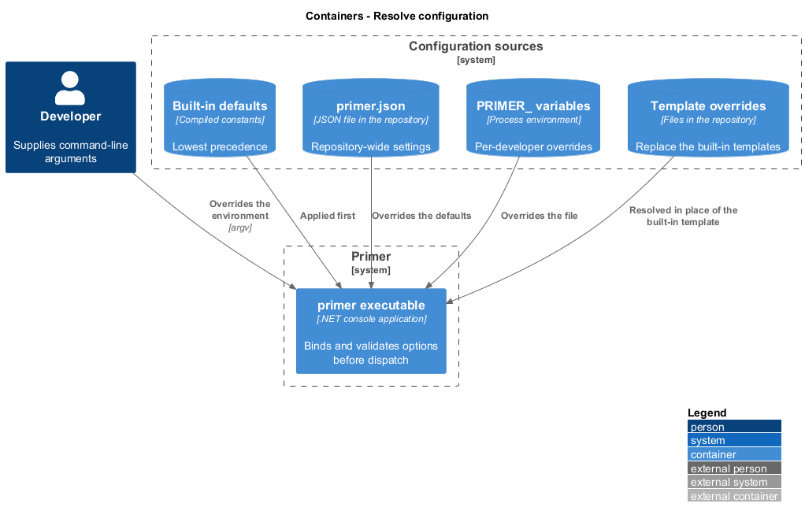
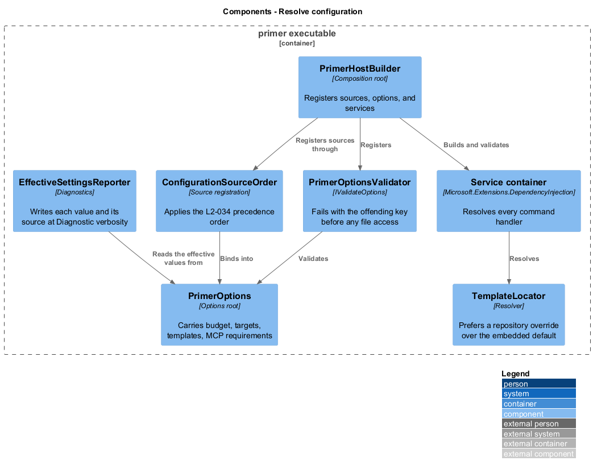
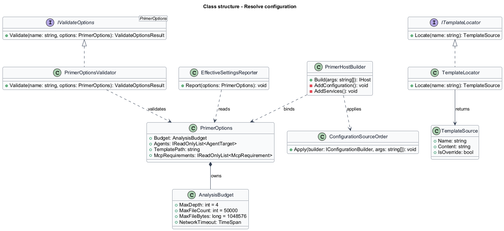
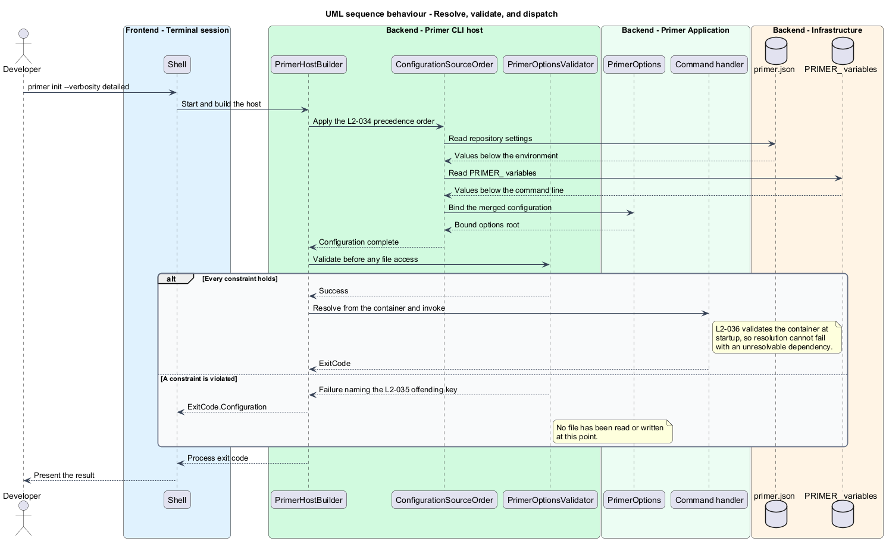

# Resolve configuration

## Overview

Primer reads settings from four places and shall resolve them into one effective
value per setting before any command does work. This feature covers that
resolution, the validation that follows it, and the container from which every
command handler is drawn.

**precedence** — fixed order in which configuration sources override one another

**options pattern** — Microsoft.Extensions convention binding a configuration
section to a strongly typed class and validating it at startup

**composition root** — single location at which the service graph is registered

The four sources, in increasing precedence, are built-in defaults, a repository
configuration file, `PRIMER_`-prefixed environment variables, and command-line
arguments. A developer overriding a setting on the command line shall see that
value win over every other source, and a repository shall be able to fix a
setting for everyone who works in it without changing anyone's environment.

Validation happens before any file is read or written. A configuration error is
therefore reported against the configuration, not discovered halfway through a
generation run that has already written a file.

Template overrides are configuration as well. A repository that supplies its own
template file for a generated document shall have that file used in place of the
built-in one, so a team can shape output without forking the tool.

## Description

- **`PrimerOptions`** — options root bound from the `Primer` configuration
  section. It carries the analysis budget, the agent target selection, the
  template path, and the MCP requirement list.
- **`PrimerHostBuilder`** — composition root. It registers the configuration
  sources in precedence order, binds `PrimerOptions`, and registers every
  service, command module, and handler.
- **`ConfigurationSourceOrder`** — the ordered source registration: defaults, then
  `primer.json` at the repository root, then `PRIMER_`-prefixed environment
  variables, then parsed command-line arguments.
- **`PrimerOptionsValidator`** — `IValidateOptions<PrimerOptions>` implementation.
  It checks each declared constraint and returns a failure naming the offending
  key, which the host surfaces as `ExitCode.Configuration`.
- **`EffectiveSettingsReporter`** — writes each setting with its value and
  originating source to stderr when verbosity is `Diagnostic`.
- **`ITemplateLocator`** and **`TemplateLocator`** — resolve a template by name,
  preferring a repository override over the embedded default.
- **`TemplateToken`** — enumeration of the tokens a template may reference; an
  unknown token in an override is a configuration failure.

## Requirements

The feature realizes the following level-2 (L2) requirements. Each L2
requirement refines a level-1 (L1) requirement, cited by identifier.

| L2 ID | Refines (L1) | Requirement |
|-------|--------------|-------------|
| `L2-034` | `L1-008` | Configuration shall resolve in the order defaults, configuration file, `PRIMER_` environment variables, command-line arguments, with each source overriding the ones before it. |
| `L2-035` | `L1-008` | Options shall be validated before any file is read or written, and a violation shall name the offending key and exit `3`. |
| `L2-036` | `L1-008` | Every command handler shall be resolved from the service container, and the container shall validate at startup with no unresolvable or captive dependency. |
| `L2-037` | `L1-008` | A repository template override shall be used in place of the built-in template, and an unknown token in an override shall exit `3`. |

## Diagrams

### System context

Configuration arrives from the developer's command line, the developer's
environment, and a file held in the source repository.

### Containers

The configuration sources are distinct stores feeding one executable. The
repository supplies both the configuration file and any template override.

### Components

`PrimerHostBuilder` registers the sources in precedence order and binds
`PrimerOptions`, which `PrimerOptionsValidator` checks before dispatch.

### Class structure

`PrimerOptions` is the bound root. Validation is an `IValidateOptions`
implementation rather than logic embedded in a handler.

### Behaviour — resolve, validate, and dispatch

Binding and validation both complete before the handler runs, so a configuration
failure exits before the first file is touched.

