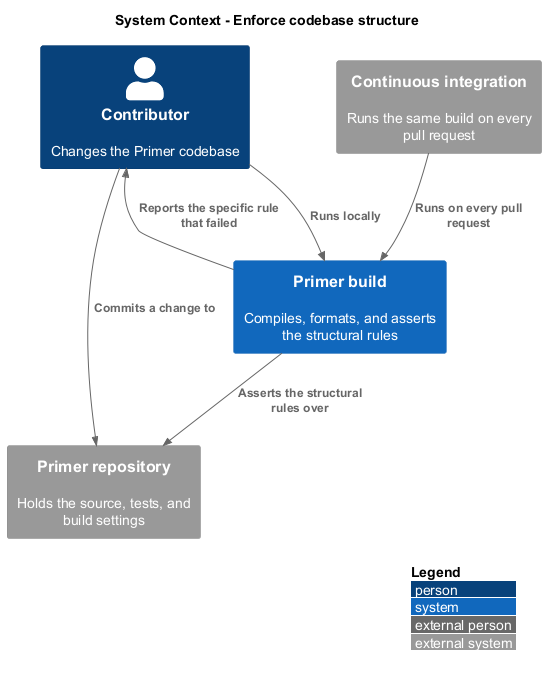
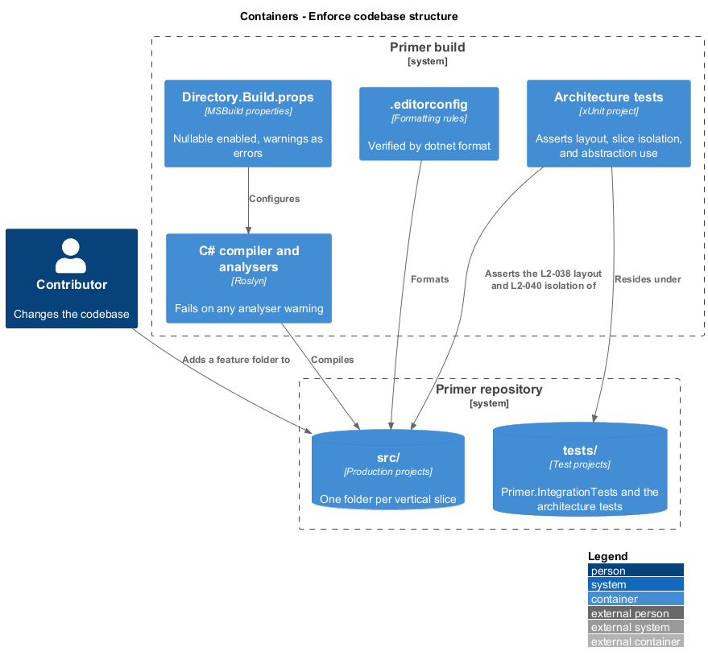
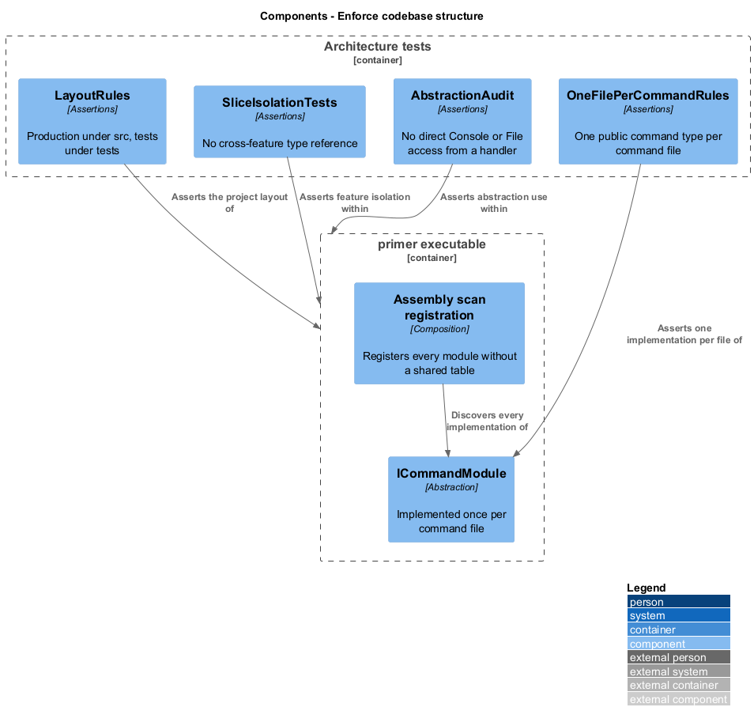
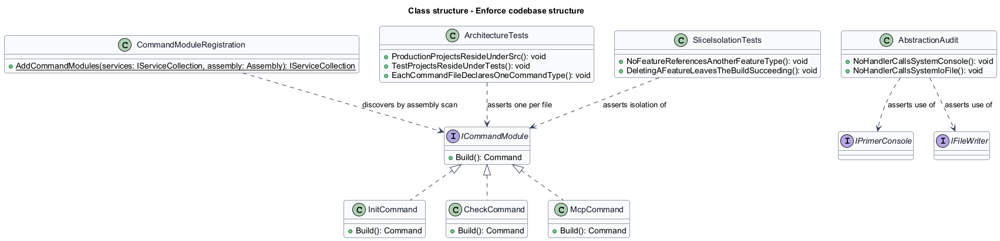
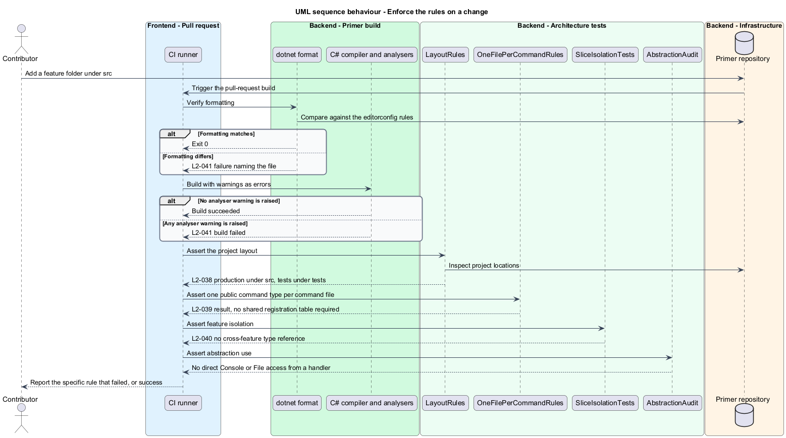

# Enforce codebase structure

## Overview

Primer's own architectural rules are stated in its requirements: source under
`src/`, tests under `tests/`, one file per command, features organised as
vertical slices, and no direct console or file access from a command handler. A
rule that is checked only by review is a rule that erodes. This feature covers
the mechanisms that make each of those rules fail the build when broken.

**vertical slice** — feature folder holding the command, handler, options,
services, and templates for one capability

**one file per command** — convention placing a command's definition and handler
in a single file named after the command

**architecture test** — automated test asserting a structural rule over the
compiled assembly or the source tree

The distinction that matters is between a convention and a constraint. A
convention is documented and hoped for; a constraint is enforced by a tool that
fails. Each rule here is paired with the mechanism that enforces it, so a
violation is reported at build time rather than discovered later.

Command registration is discovery-based rather than table-based. Every command
implements `ICommandModule` and is registered by assembly scan, so adding a
command means adding one file and never editing a shared registration list. That
is what allows the one-file-per-command rule to hold without a central file that
every feature would otherwise edit.

## Description

- **`Directory.Build.props`** — repository-wide build settings enabling nullable
  reference types and treating warnings as errors for every project.
- **`.editorconfig`** — formatting and analyser severity rules, verified in the
  build by `dotnet format --verify-no-changes`.
- **`ICommandModule`** — the abstraction every command file implements. Assembly
  scanning registers each implementation, so no shared switch statement exists to
  be edited.
- **`ArchitectureTests`** — test fixture asserting the structural rules: every
  production project resides under `src/`, every test project under `tests/`,
  each file under `Commands` declares exactly one public command type, and no
  handler type references `System.Console` or `System.IO.File`.
- **`SliceIsolationTests`** — assert that no feature folder references a type
  declared inside another feature folder, so shared behaviour lives in the shared
  abstractions location.
- **`AbstractionAudit`** — the specific assertion that handlers reach the console
  and the file system only through `IPrimerConsole` and `IFileWriter`.

## Requirements

The feature realizes the following level-2 (L2) requirements. Each L2
requirement refines a level-1 (L1) requirement, cited by identifier.

| L2 ID | Refines (L1) | Requirement |
|-------|--------------|-------------|
| `L2-038` | `L1-009` | Every production project shall reside under `src/` and every test project under `tests/`, the solution shall reference no project outside them, and the integration test project shall be `tests/Primer.IntegrationTests`. |
| `L2-039` | `L1-009` | Each command's definition and handler shall reside in a single file named after the command, each such file shall declare exactly one public command type, and adding a command shall require no edit to a shared registration switch. |
| `L2-040` | `L1-009` | A feature's command, handler, options, services, and templates shall reside in one folder, no feature folder shall reference a type declared inside another, and deleting a feature folder shall leave the build succeeding. |
| `L2-041` | `L1-009` | Nullable reference types shall be enabled and warnings treated as errors for every project, no handler shall call `System.Console` or `System.IO.File` directly, an analyser warning shall fail CI, and `dotnet format --verify-no-changes` shall exit `0`. |

## Diagrams

### System context

The rules are enforced against the contributor at build time, in the same place
whether the build runs locally or in continuous integration.

### Containers

The enforcement mechanisms are distinct artefacts: build properties, editor
configuration, and an architecture test project.

### Components

Each rule maps to the component that enforces it, and each failure surfaces as a
build or test failure.

### Class structure

`ICommandModule` and assembly scanning are what make the one-file-per-command
rule enforceable without a central registration table.

### Behaviour — enforce the rules on a change

Formatting, compilation, and architecture assertions each fail independently, so
a report names the rule that broke rather than a generic build failure.

