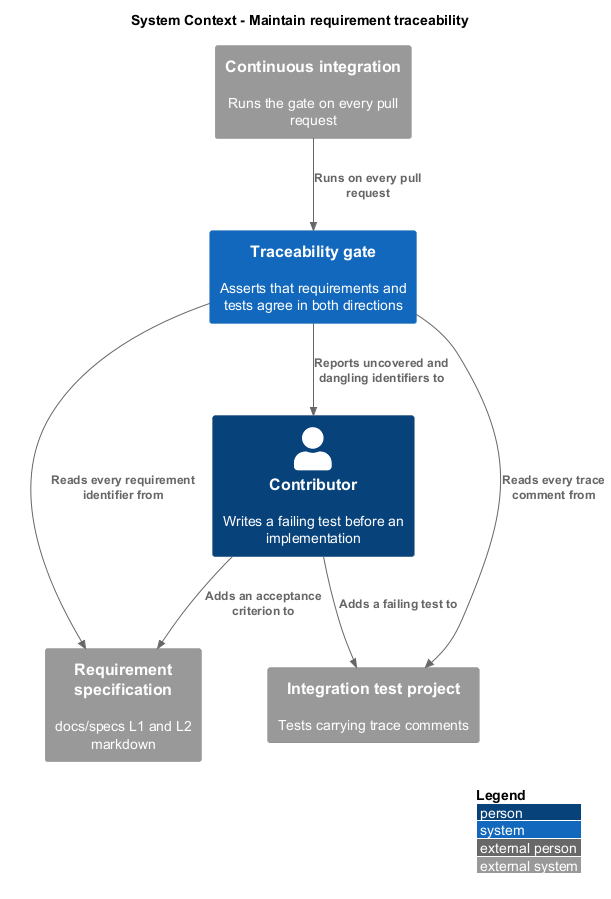
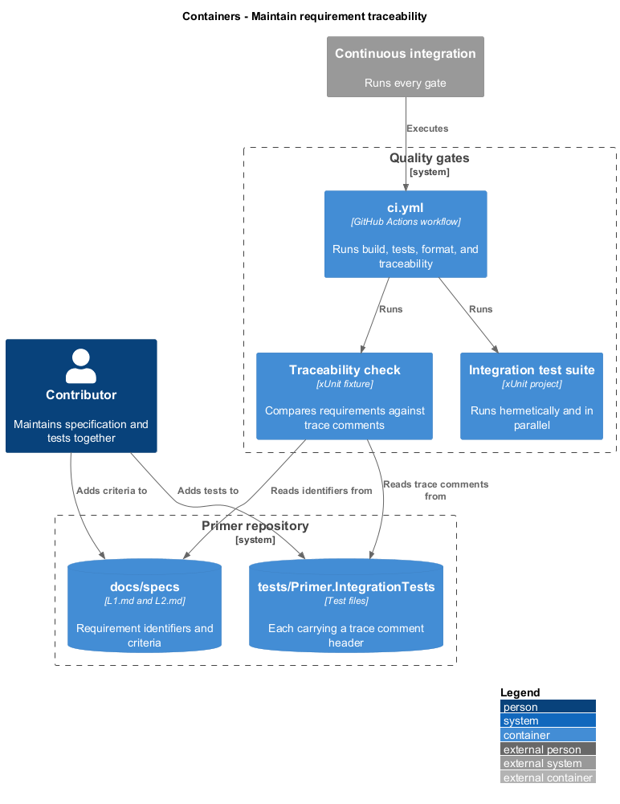
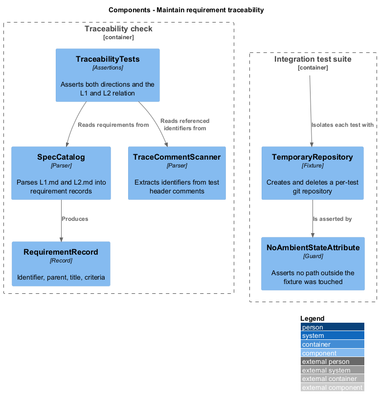
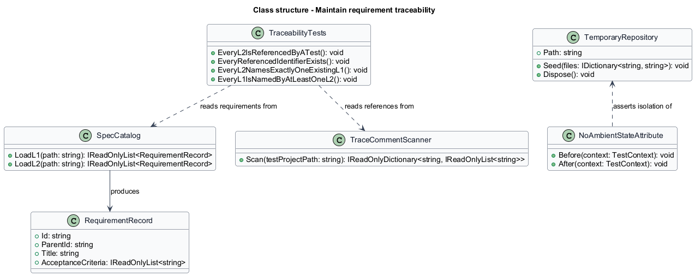
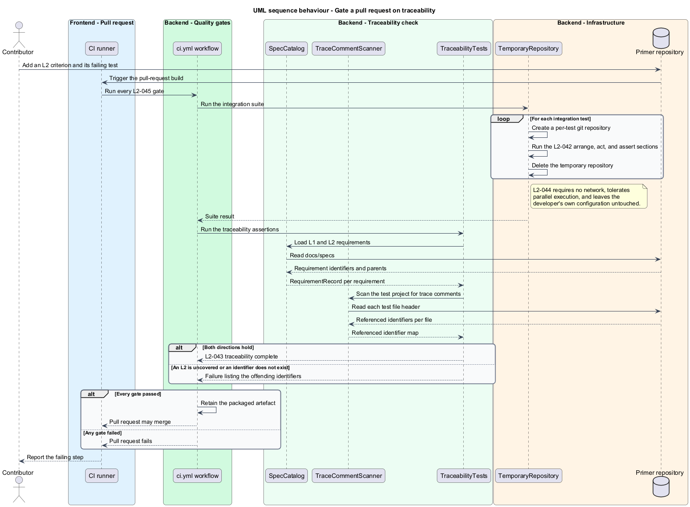

# Maintain requirement traceability

## Overview

Primer is built with acceptance-test-driven development. Every behaviour begins
as an acceptance criterion, becomes a failing integration test, and only then
becomes implementation. This feature covers the mechanism that keeps those three
artefacts in agreement once the codebase is large enough that agreement stops
being obvious.

**acceptance-test-driven development (ATDD)** — practice in which a failing
acceptance test is written before the implementation that satisfies it

**trace comment** — header comment in a test file naming the requirement
identifiers that test covers

**bidirectional traceability** — property that every requirement reaches a test
and every referenced requirement exists

An uncovered acceptance criterion is indistinguishable from a feature nobody
built. The traceability check is what makes that distinguishable: it reads the
specification and the test project and reports both directions of failure, a
requirement with no test and a test naming a requirement that does not exist.

Tests are hermetic by construction. Each integration test creates its own
temporary repository, so a test never depends on the developer's own working tree
and never modifies the developer's real agent client configuration. That property
is what allows the suite to run in parallel and to pass with no network.

The continuous integration gate ties the mechanisms together. Build, tests,
formatting, and traceability all run on every pull request, and any one of them
failing fails the request.

## Description

- **`SpecCatalog`** — parses `docs/specs/L1.md` and `docs/specs/L2.md` into
  requirement records, preserving each identifier exactly as written.
- **`RequirementRecord`** — record of the identifier, the parent identifier for an
  L2, the title, and the acceptance criteria.
- **`TraceCommentScanner`** — reads each test file's header comment and extracts
  the requirement identifiers it names.
- **`TraceabilityTests`** — assert both directions: every L2 is named by at least
  one test, and every identifier named by a test exists in the specification. The
  fixture also asserts that every L2 names exactly one existing L1 and that every
  L1 is named by at least one L2.
- **`TemporaryRepository`** — test fixture creating a git repository in a
  temporary directory, seeding it with the marker and convention files a test
  requires, and deleting it on disposal.
- **`NoAmbientStateAttribute`** — test-level guard asserting that a test touched
  no path outside its temporary repository.
- **`ci.yml`** — the continuous-integration workflow running build, test, format
  verification, and the traceability check, and retaining the packaged artefact
  on success.

## Requirements

The feature realizes the following level-2 (L2) requirements. Each L2
requirement refines a level-1 (L1) requirement, cited by identifier.

| L2 ID | Refines (L1) | Requirement |
|-------|--------------|-------------|
| `L2-042` | `L1-010` | An integration test exercising a behaviour shall exist and fail before its implementation is written, each test shall carry a header comment naming the L2 identifiers it covers, and its arrange, act, and assert sections shall correspond to the Given, When, and Then clauses. |
| `L2-043` | `L1-010` | Every L2 identifier shall be referenced by at least one test, every identifier a test references shall exist in the specification, every L2 shall name exactly one existing L1, every L1 shall be named by at least one L2, and a violation shall exit non-zero listing the offending identifiers. |
| `L2-044` | `L1-010` | Each integration test shall operate against its own temporary repository and delete it on completion, the suite shall pass with no network connectivity and under parallel execution, and no test shall modify the developer's real agent client configuration. |
| `L2-045` | `L1-010` | Continuous integration shall run the build, the full test suite, the format check, and the traceability check on every pull request, shall fail the request when any step fails, and shall retain the packaged artefact on success. |

## Diagrams

### System context

Traceability connects three artefacts a contributor maintains: the specification,
the tests, and the implementation.

### Containers

The specification and the test project are separate stores, and the traceability
check is the container that reads both.

### Components

`SpecCatalog` and `TraceCommentScanner` supply the two sides of the comparison
that `TraceabilityTests` asserts.

### Class structure

The catalog and the scanner are independent readers, so neither side of the
comparison derives from the other.

### Behaviour — gate a pull request on traceability

Every gate runs, so a report names each failing step rather than stopping at the
first.

