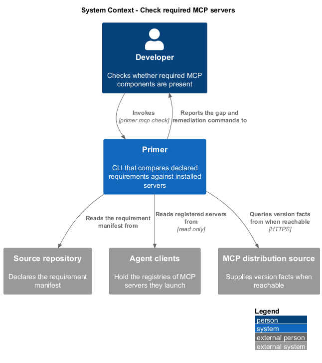
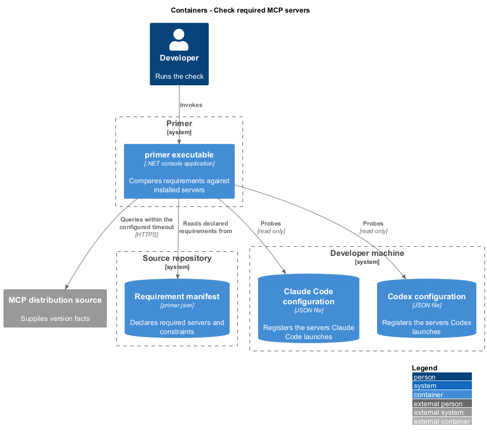
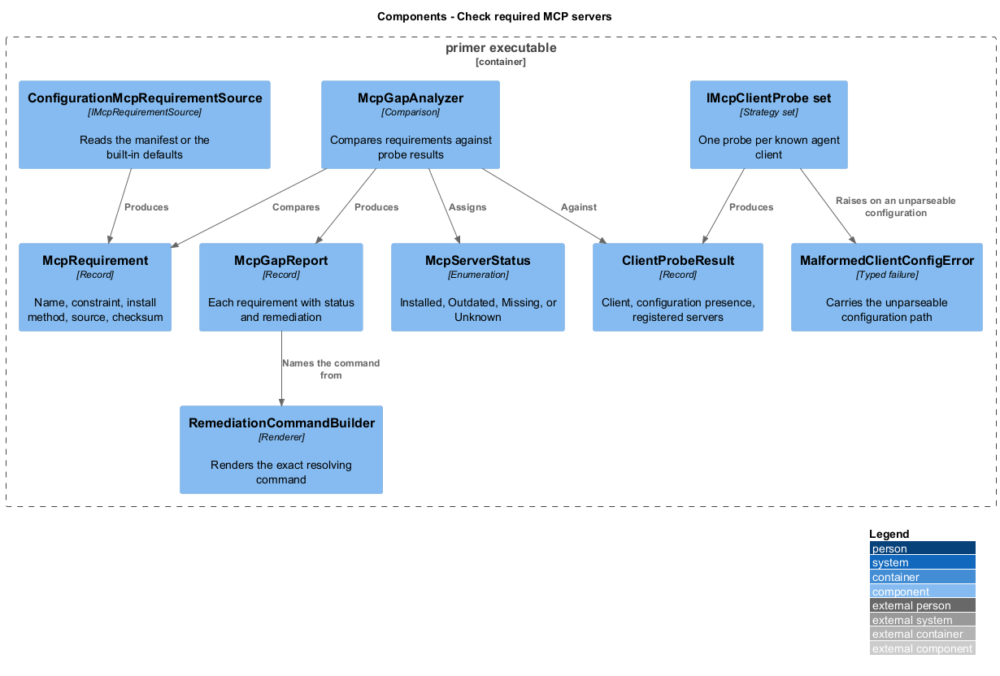
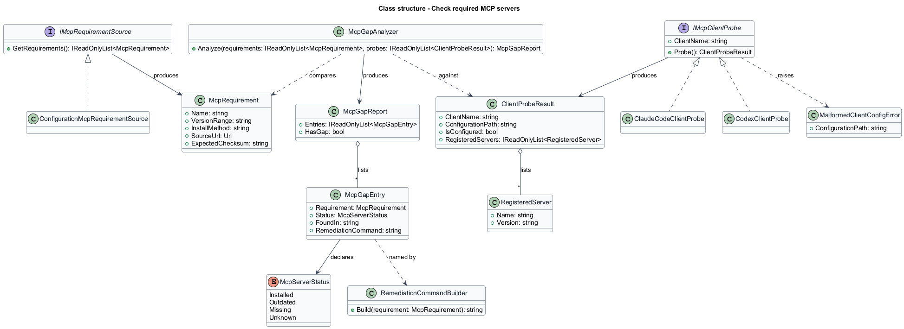
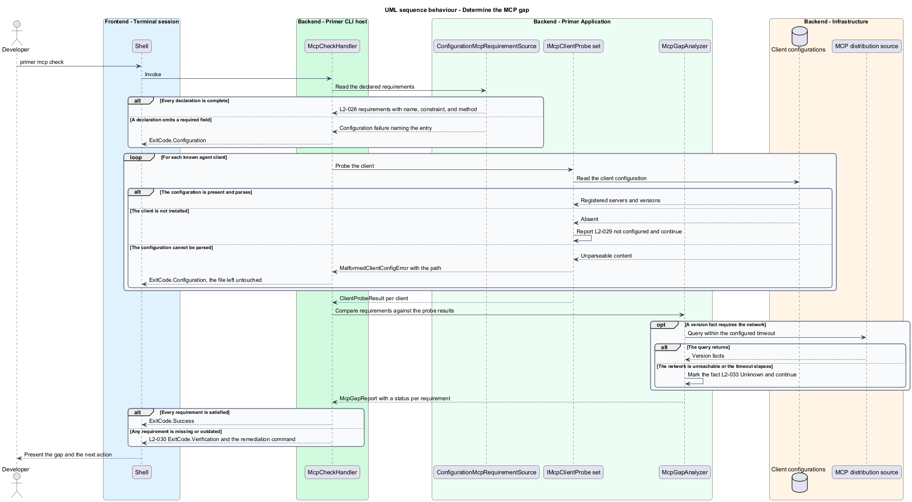

# Check required MCP servers

## Overview

A coding agent working in a repository often depends on Model Context Protocol
servers being available in the developer's agent client. A repository that needs
a database server or a documentation server gains nothing from guidance that
assumes one is present when it is not. This feature determines what a repository
requires, what the machine already has, and the gap between them.

**Model Context Protocol (MCP)** — protocol by which a coding agent reaches
external tools and data sources through a server process

**MCP server** — process an agent client launches to provide one such capability

**agent client** — application that hosts an agent and holds the registry of MCP
servers it launches

**requirement manifest** — declared list of the MCP servers a repository needs,
each with a version constraint and an install method

Requirements are data rather than compiled-in constants. A repository declares
what it needs, so the tool serves repositories whose dependencies its authors
never anticipated, and the declaration is reviewable in the same way as any other
repository configuration.

Detection reads the configuration files of known agent clients. A client that is
not installed is reported as not configured rather than treated as a failure,
because a developer using one agent shall not be told that another agent's absence
is a problem. A configuration file that exists but cannot be parsed is a different
matter: it is reported with its path and left untouched, because guessing at the
contents of a malformed configuration risks corrupting it.

The check is designed to be useful without a network. Anything determinable from
local files is determined and reported, and only genuinely network-dependent facts
are reported as unknown.

## Description

- **`McpRequirement`** — record of the server name, the version constraint, the
  install method, the source URL, and the expected checksum.
- **`IMcpRequirementSource`** and **`ConfigurationMcpRequirementSource`** — read
  the manifest from `PrimerOptions`, falling back to the built-in defaults when a
  repository declares none. A requirement missing a mandatory field is a
  configuration failure.
- **`IMcpClientProbe`** — one implementation per known agent client. Each locates
  that client's configuration file, parses it, and reports the servers registered
  in it.
- **`ClientProbeResult`** — record of the client, whether its configuration was
  found, and the servers it registers.
- **`McpGapAnalyzer`** — compares requirements against probe results and produces
  the report.
- **`McpServerStatus`** — enumeration of `Installed`, `Outdated`, `Missing`, and
  `Unknown`. `Unknown` is reserved for facts that could not be determined without
  a network.
- **`McpGapReport`** — record listing each requirement with its status, the
  configuration file it was found in, and the remediation command that resolves
  it.
- **`RemediationCommandBuilder`** — renders the exact command that installs or
  upgrades a given requirement.
- **`MalformedClientConfigError`** — typed failure carrying the client
  configuration path, mapped to `ExitCode.Configuration`.

## Requirements

The feature realizes the following level-2 (L2) requirements. Each L2
requirement refines a level-1 (L1) requirement, cited by identifier.

| L2 ID | Refines (L1) | Requirement |
|-------|--------------|-------------|
| `L2-028` | `L1-007` | Required MCP servers shall be declared as data and shall be listable with name, version constraint, and install method, and a declaration missing a required field shall exit `3`. |
| `L2-029` | `L1-007` | The tool shall report each required server as installed, outdated, or missing from the known client configurations, shall report an absent client as not configured and continue, and shall exit `3` on a malformed configuration without modifying it. |
| `L2-030` | `L1-007` | A missing or outdated server shall exit `4` and name the exact remediation command, and a fully satisfied set shall exit `0`. |
| `L2-033` | `L1-007` | Without network connectivity the check shall still report locally determinable status, shall mark network-dependent facts unknown, and a request exceeding the configured timeout shall be abandoned and reported. |

## Diagrams

### System context

The check reads a repository's declaration and the agent clients installed on the
developer's machine.

### Containers

Each agent client holds its own configuration store, and the repository holds the
requirement manifest.

### Components

Probes are one per client, and the gap analyzer compares their results against
the declared requirements.

### Class structure

`IMcpClientProbe` isolates the per-client configuration format, so support for a
further client adds a probe rather than changing the analyzer.

### Behaviour — determine the gap

Every probe runs even when one client is absent or unreadable, so a single
missing client does not hide the state of the others.

