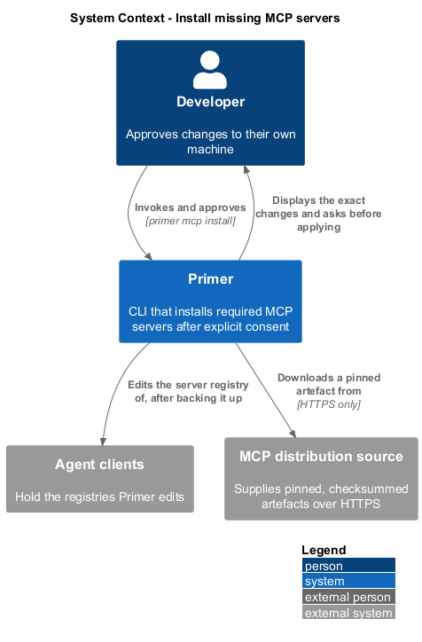
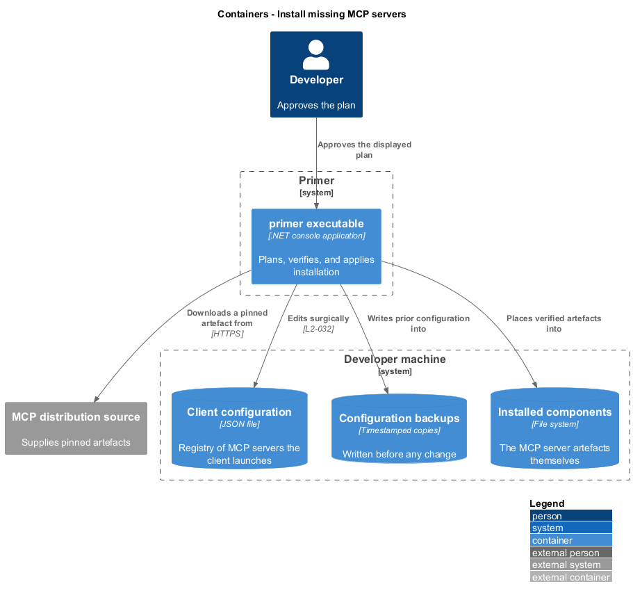
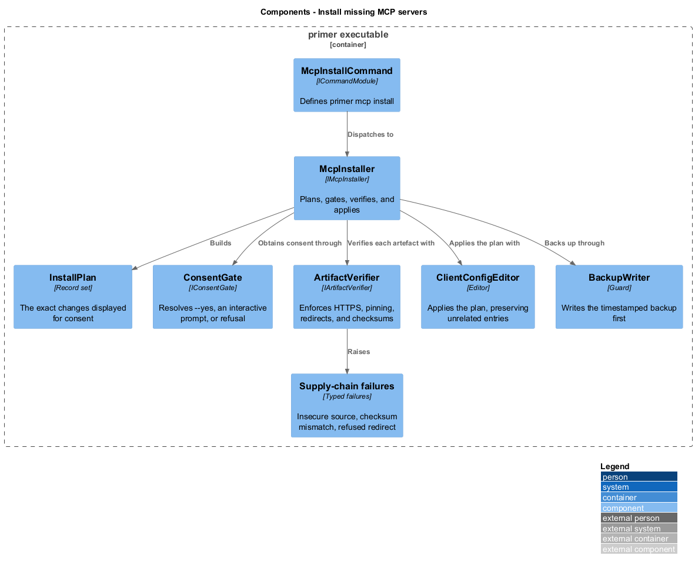
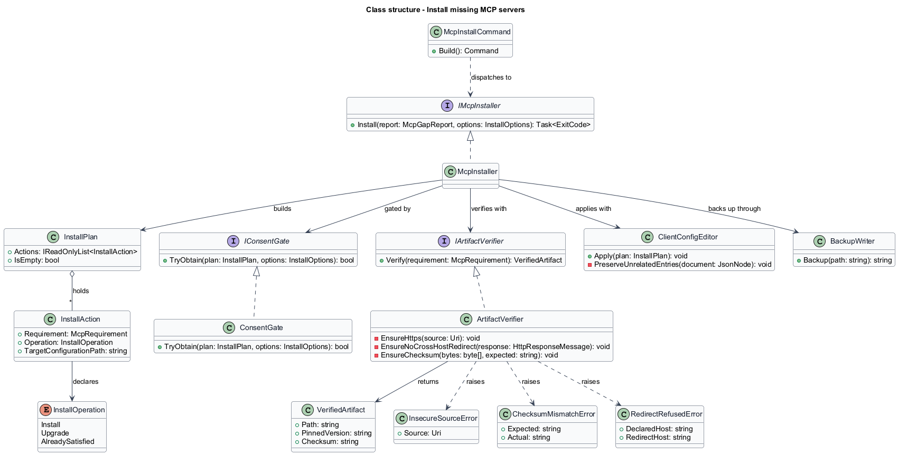
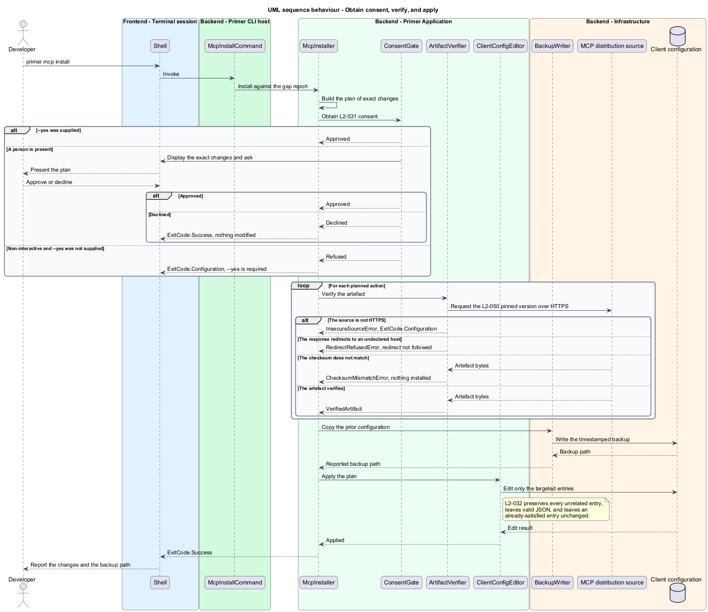

# Install missing MCP servers

## Overview

Reporting a gap is only half of the job. This feature closes it, by installing
the MCP servers a repository requires and registering them in the developer's
agent client. It is the only feature in Primer that changes state outside the
target repository, and it is designed around that fact.

**consent** — explicit approval, given interactively or by `--yes`, without which
no change is applied

**surgical edit** — modification that changes only the entries it targets and
preserves every other entry in the file

**pinned version** — exact version, rather than a floating tag, at which a
component is resolved

Installation never happens implicitly. `primer init` installs nothing, so a
developer generating guidance cannot accidentally alter the machine. `primer mcp
install` displays the exact changes and asks before applying them, and a
non-interactive session without `--yes` refuses rather than proceeding on an
assumption about what an absent operator would have wanted.

The client configuration belongs to the developer, not to Primer. Entries Primer
did not add are preserved with their original values, a timestamped backup is
written before any change, and the resulting file is valid JSON that the client
loads. A requirement already satisfied is reported as such and left alone.

Supply-chain handling is deliberate. Components resolve at pinned versions, over
HTTPS only, with the downloaded artefact's checksum verified before anything is
installed. A redirect to a host other than the declared one is not followed,
because a redirect is exactly how a compromised distribution point would move a
download somewhere else.

## Description

- **`McpInstallCommand`** — the command module defining `primer mcp install`.
- **`IMcpInstaller`** and **`McpInstaller`** — plan the changes, obtain consent,
  verify each artefact, and apply the plan.
- **`InstallPlan`** — the ordered set of `InstallAction` records, rendered for
  consent before anything is applied.
- **`InstallAction`** — record of the requirement, the operation, and the target
  client configuration.
- **`IConsentGate`** and **`ConsentGate`** — resolve consent from `--yes`, from an
  interactive prompt, or refuse when neither is available.
- **`IArtifactVerifier`** and **`ArtifactVerifier`** — enforce the HTTPS scheme,
  reject a cross-host redirect, and compare the artefact checksum against the
  declared value.
- **`ClientConfigEditor`** — apply the plan to a client configuration file,
  preserving unrelated entries and producing valid JSON.
- **`BackupWriter`** — write the timestamped backup and report its path.
- **`InsecureSourceError`**, **`ChecksumMismatchError`**, and
  **`RedirectRefusedError`** — typed failures for the three supply-chain
  rejections.

## Requirements

The feature realizes the following level-2 (L2) requirements. Each L2
requirement refines a level-1 (L1) requirement, cited by identifier.

| L2 ID | Refines (L1) | Requirement |
|-------|--------------|-------------|
| `L2-031` | `L1-007` | Installation shall display the exact changes and obtain consent before applying any, shall refuse in a non-interactive session without `--yes`, shall apply nothing under `--dry-run`, and `primer init` shall install nothing. |
| `L2-032` | `L1-007` | A client configuration edit shall preserve every unrelated entry, shall write a timestamped backup first and report its path, shall leave valid JSON, and shall leave an already-satisfied entry unchanged. |
| `L2-050` | `L1-011` | A component shall resolve at a pinned version over HTTPS, a checksum mismatch shall install nothing and exit `1`, and a redirect to an undeclared host shall not be followed. |

## Diagrams

### System context

Installation reaches outside the repository: it changes the developer's machine
and downloads from a distribution source.

### Containers

The client configuration and its backup are distinct stores, and the distribution
source sits outside the machine entirely.

### Components

The consent gate and the artefact verifier both sit between the plan and the
editor, so neither can be bypassed.

### Class structure

The three supply-chain rejections are distinct types, so each maps to its own
message and none is reported as a generic failure.

### Behaviour — obtain consent, verify, and apply

Consent precedes verification, verification precedes the backup, and the backup
precedes the edit. No later step runs when an earlier one refuses.

