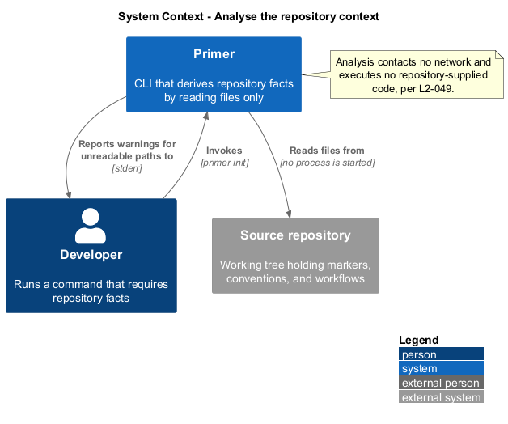
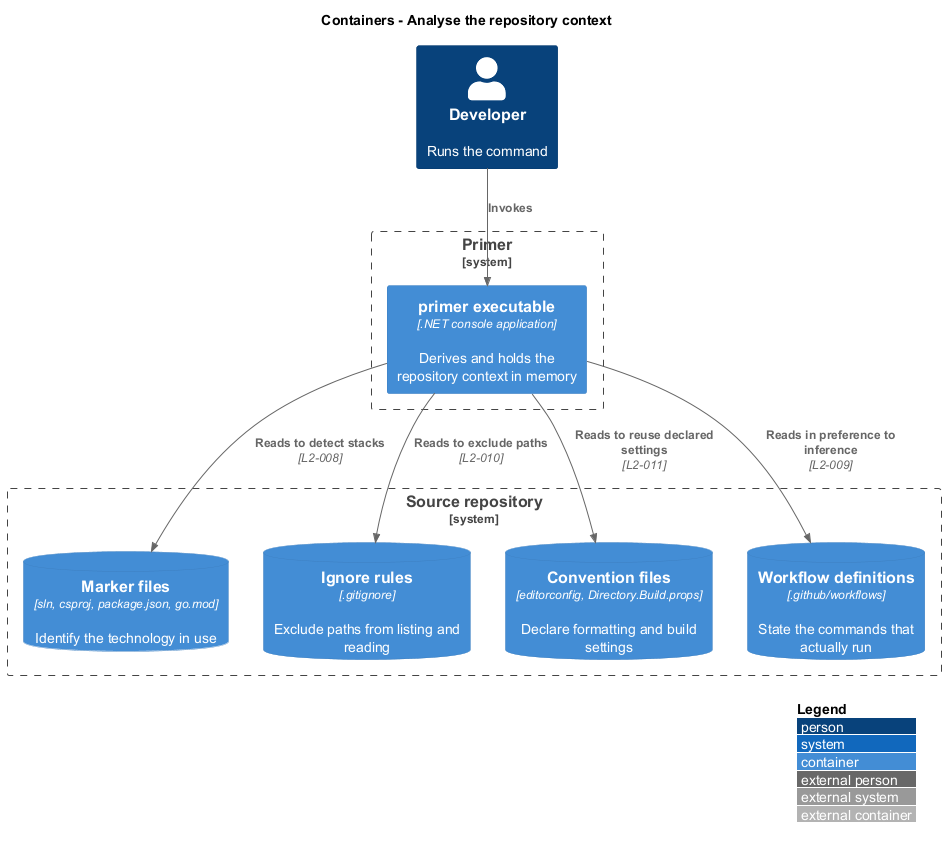
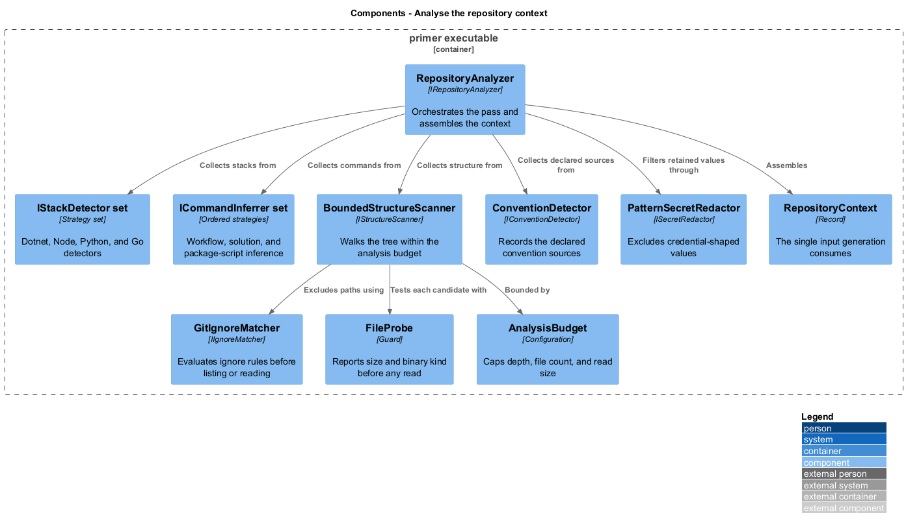
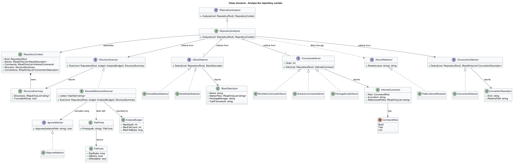
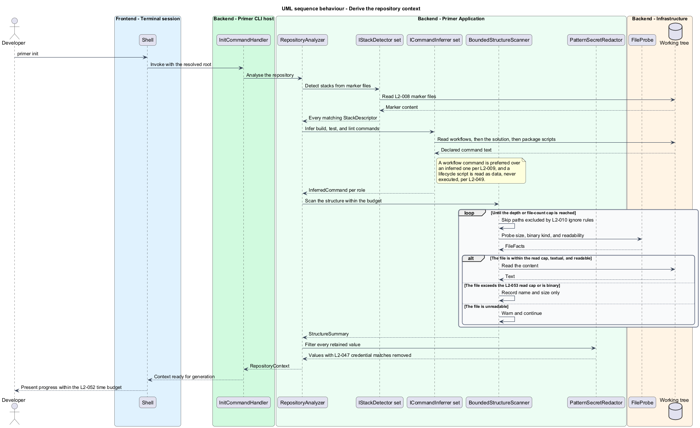

# Analyse the repository context

## Overview

Generated agent guidance is only useful when it states facts that hold for the
repository it describes. This feature derives those facts. It identifies the
technology in use, infers the exact commands that build and test the code,
summarises the directory layout, and records the conventions the repository
already declares.

**marker file** — file whose presence identifies a technology, such as `.sln` for
a .NET solution or `package.json` for a Node package

**repository context** — the derived, in-memory record of everything analysis
learned, and the sole input to generation

**analysis budget** — configured caps on traversal depth, file count, and per-file
read size that bound the cost of analysis

Analysis is strictly a read. No repository-supplied code runs at any point:
lifecycle scripts declared in a package manifest are read as data, and no child
process is started. This matters because Primer is invoked against repositories a
developer may not have written, and inferring a build command shall never mean
running one.

Analysis is also bounded. A repository may hold a hundred thousand files or a
two-gigabyte artefact, and neither shall cause the run to exhaust memory or hang.
Traversal stops at a configured depth and file count, oversized files are
recorded by name and size without being read, and the whole run completes within
a stated time budget.

What analysis learns is preferred over what it guesses. When a continuous
integration workflow already states how the repository is built, that command is
taken in preference to one inferred from marker files, because the workflow is
what actually runs.

## Description

- **`IRepositoryAnalyzer`** and **`RepositoryAnalyzer`** — orchestrate the pass
  and assemble the `RepositoryContext`.
- **`RepositoryContext`** — record carrying the `RepositoryRoot`, the detected
  stacks, the inferred commands, the structure summary, and the detected
  conventions.
- **`IStackDetector`** — one implementation per technology:
  `DotnetStackDetector`, `NodeStackDetector`, `PythonStackDetector`,
  `GoStackDetector`. Each reports a `StackDescriptor` or nothing. Every detector
  that matches contributes; none suppresses another.
- **`StackDescriptor`** — record of the stack name, the marker files found, the
  package manager, and the test framework.
- **`ICommandInferrer`** — ordered strategies producing an `InferredCommand`:
  `WorkflowCommandInferrer` reads `.github/workflows`, `SolutionCommandInferrer`
  reads the solution file, `PackageScriptInferrer` reads `package.json` scripts.
  The first strategy to produce a command for a role wins.
- **`InferredCommand`** — record of the role, the exact invocation including
  flags, and the repository-relative paths it references.
- **`IStructureScanner`** and **`BoundedStructureScanner`** — walk the tree within
  the budget, tracking visited real paths so a link cycle terminates.
- **`IIgnoreMatcher`** and **`GitIgnoreMatcher`** — evaluate `.gitignore` rules so
  ignored paths are neither listed nor read.
- **`IConventionDetector`** and **`ConventionDetector`** — record `.editorconfig`,
  `Directory.Build.props`, and workflow files as the authoritative sources.
- **`FileProbe`** — inspects a candidate before reading it, reporting size and
  whether the leading bytes indicate binary content.
- **`ISecretRedactor`** and **`PatternSecretRedactor`** — exclude values matching
  known credential patterns from anything analysis retains.
- **`AnalysisBudget`** — the caps, bound from configuration.

## Requirements

The feature realizes the following level-2 (L2) requirements. Each L2
requirement refines a level-1 (L1) requirement, cited by identifier.

| L2 ID | Refines (L1) | Requirement |
|-------|--------------|-------------|
| `L2-008` | `L1-003` | The tool shall identify the languages, frameworks, package managers, and test frameworks in use from marker files present in the repository, and shall report every detected stack. |
| `L2-009` | `L1-003` | Inferred commands shall be exact and runnable, including the flags needed for reproducibility, and shall never be a bare tool name. |
| `L2-010` | `L1-003` | Structure discovery shall respect ignore rules, shall stop at the configured depth and file-count caps, and shall terminate on a link cycle. |
| `L2-011` | `L1-003` | The tool shall detect and reuse the engineering conventions the repository already declares rather than inventing new ones. |
| `L2-012` | `L1-003` | Analysis shall not read content it does not need, shall not parse binary files as text, and shall continue past a file it lacks permission to read. |
| `L2-047` | `L1-011` | A value matching a known credential pattern shall be excluded from generated output and logs, and `.env` contents shall not be read. |
| `L2-049` | `L1-011` | No child process shall be started during `primer init` or `primer check`, and repository lifecycle scripts shall be read as data rather than executed. |
| `L2-052` | `L1-012` | `primer init` shall complete in under 2 s on a 5,000-file repository and under 10 s on a 100,000-file repository, each at the 95th percentile. |
| `L2-053` | `L1-012` | Peak managed heap shall remain below 256 MiB on a 100,000-file repository, and a file exceeding the read cap shall never be loaded in full. |

## Diagrams

### System context

Analysis reads the working tree and nothing else. No network is contacted and no
repository-supplied code runs.

### Containers

The repository presents four kinds of store to analysis: marker files, ignore
rules, convention files, and workflow definitions.

### Components

`RepositoryAnalyzer` fans out to the detectors, inferrers, and scanner, then
assembles one `RepositoryContext` for generation to consume.

### Class structure

Detection and inference are both strategy sets behind interfaces, so a new
technology is added without modifying the analyzer.

### Behaviour — derive the repository context

The scan is bounded before it starts. Each candidate file is probed for size and
kind before any content is read, and every retained value passes the redactor.

