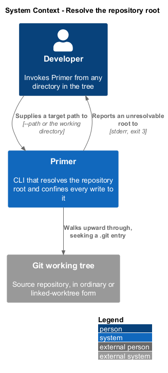
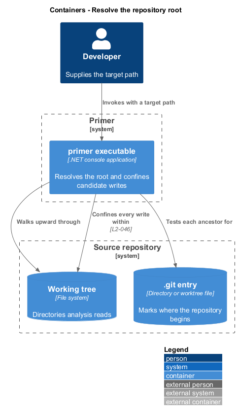
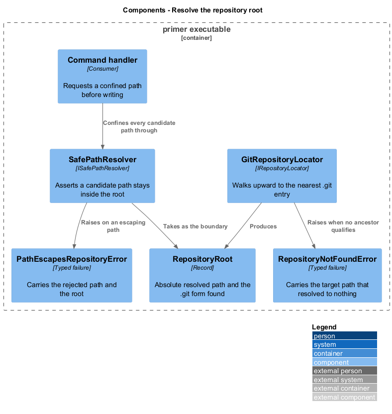
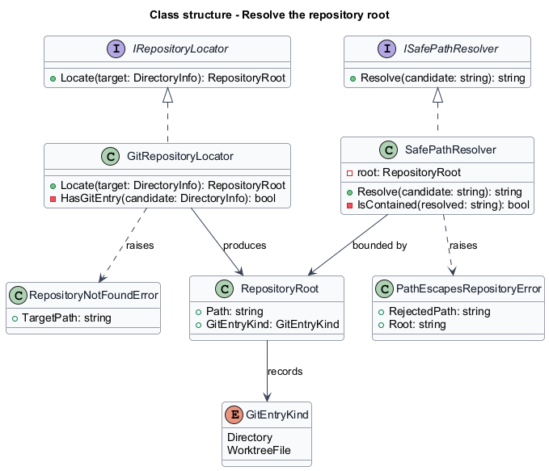
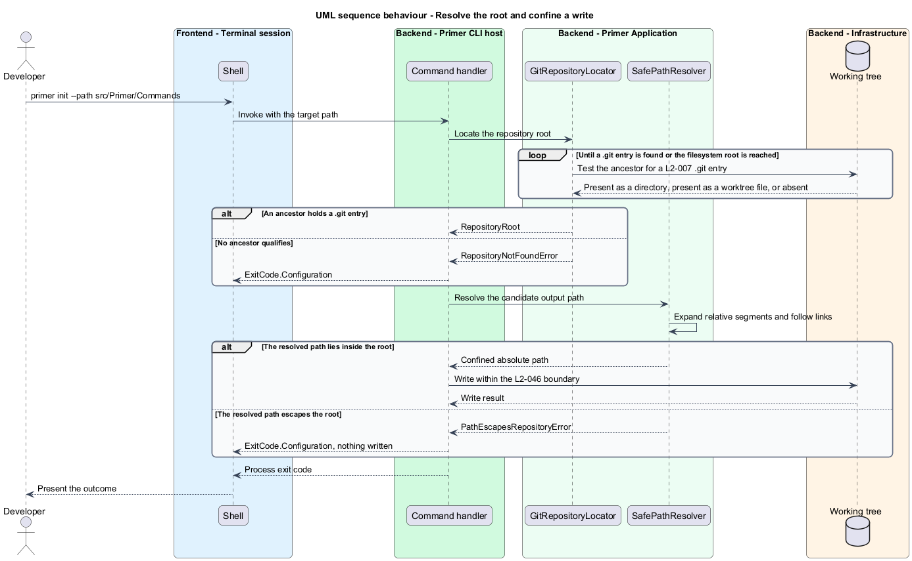

# Resolve the repository root

## Overview

Every Primer command operates on a repository rather than on a directory. The
root of that repository is the anchor for two things: the paths analysis reads,
and the boundary outside which nothing shall be written. This feature covers
finding that anchor and enforcing that boundary.

**repository root** — nearest ancestor directory of the target path that contains
a `.git` entry

**target path** — directory a command operates on, taken from `--path` when
supplied and from the current working directory otherwise

**containment** — property that a resolved output path lies inside the repository
root after all links and relative segments are resolved

A developer invoking Primer from a nested source folder shall reach the same
repository root as one invoking it from the top. Resolution walks upward rather
than requiring the developer to stand in the right place.

The `.git` entry is a directory in an ordinary clone and a file in a linked
worktree. Both forms resolve, because a developer working in a worktree is
working in a repository and shall not be treated differently.

Containment is enforced here rather than at each write site. Every path a command
intends to write passes through one resolver, so a traversal segment, an absolute
path, or a symbolic link pointing outside the repository is refused in one place
instead of being caught inconsistently across features.

## Description

- **`IRepositoryLocator`** and **`GitRepositoryLocator`** — walk upward from the
  target path, testing each ancestor for a `.git` entry. The locator accepts both
  the directory form and the worktree file form, and stops at the filesystem
  root.
- **`RepositoryRoot`** — record carrying the absolute resolved path and the form
  of `.git` that was found. It is the value every downstream service takes as its
  origin.
- **`RepositoryNotFoundError`** — typed failure raised when no ancestor holds a
  `.git` entry. It carries the target path so the message can name it.
- **`ISafePathResolver`** and **`SafePathResolver`** — resolve a candidate output
  path against the root, expanding relative segments and following links, then
  assert containment. A candidate that escapes yields
  `PathEscapesRepositoryError`.
- **`PathEscapesRepositoryError`** — typed failure carrying the rejected path and
  the root it escaped, mapped by the host to `ExitCode.Configuration`.

## Requirements

The feature realizes the following level-2 (L2) requirements. Each L2
requirement refines a level-1 (L1) requirement, cited by identifier.

| L2 ID | Refines (L1) | Requirement |
|-------|--------------|-------------|
| `L2-007` | `L1-003` | The tool shall resolve the repository root by walking upward from the target path to the nearest directory containing a `.git` entry. |
| `L2-046` | `L1-011` | Every path written shall reside within the resolved repository root, and a path resolving outside it, whether through traversal segments, an absolute path, or a symbolic link, shall be refused with exit `3`. |

## Diagrams

### System context

Resolution reads the developer's target path and the working tree. Its result
constrains every later write Primer performs.

### Containers

The working tree and its `.git` entry are distinct stores from Primer's
perspective: one supplies the files to analyse, the other marks where the
repository begins.

### Components

`GitRepositoryLocator` produces the root, and `SafePathResolver` consumes it as
the boundary for every candidate output path.

### Class structure

Both services sit behind interfaces so that a test substitutes a temporary
repository without touching the developer's own working tree.

### Behaviour — resolve the root and confine a write

The upward walk terminates at the first `.git` entry or at the filesystem root.
Containment is asserted for each candidate path before any write occurs.

